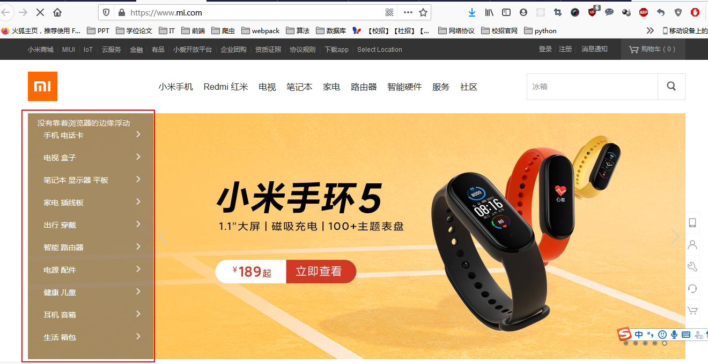

# 一、CSS 选择器    
  
## 1. 基础选择器   

标签选择器，类选择器，id 选择器，通配符选择器  
通配符选择器是可以选择页面上所有的标签  
多类名之间用空格分开   

## 2. 复合选择器  


# 二、CSS 文本属性  
  
## 1. 字体 font-family  
     
- 两种字体之间用逗号隔开
- 字体的名字是两个单词，就用引号括起来    

```
p {
    font-family: "Microsoft YaHei", Arial
}

```   

## 2. 字体大小 font-size  
   
谷歌浏览器默认字体大小是16px。可以给 body 标签指定文字的大小，就可以修改除标题外整个页面的文字大小了，再根据特殊标签指定特殊的大小。  
   
## 3. 字体的粗细 font-weight   
   
取值是 normal（400），bold（700），number。可以通过 number 来进行设置具体加粗的程度。`font-weight: 700` 数字后面没有单位。实际开发中更常用数字的形式。     
html 里面的 strong 和 b 标签也可以实现加粗的效果。   

## 4. 字体风格 font-style   
   
取值有：normal，italic（斜体）   
  
## 5. 字体的复合写法     
   
`font: font-style font-weight font-size/line-height font-family`   
font-size 和 font-family 必须有，不能省略，其他可以省略。

## 6. css 文本属性   
   
css Text（文本）属性可定义文本的外观，比如文本的颜色，对齐文本，装饰文本，文本缩进，行间距。
    
#### 6.1 文本颜色   
   
`color: #000`   
   
#### 6.2 对齐文本   

text-align 属性用于设置元素盒子内的文本的水平对齐方式   
      
text-align 取值分别是：
         
- left （默认值）：左对齐   
- center：居中对齐   
- right：右对齐   
   
#### 6.3 装饰文本   
   
text-decoration 属性规定添加到文本的装饰，可以给文本添加下划线，删除线和上划线    
   
text-decoration 取值分别是：
  
- none （默认值），没有任何装饰线
- overline，上划线
- linethrough，中划线
- underline，下划线      
  
应用场景是，页面的 a 标签连接会默认的有一条下划线，为了美观，我们可以把 a 标签的下划线去掉，采用的方式就是 `text-decoretion: none`   
  
重点记住如何删除下划线和如何添加下划线
    
#### 6.4 文本缩进   
    
text-indent 用来给文本的首行进行缩进，通常是将段落的首行进行缩进   

`text-indent : 10px` 或者 `text-indent: 2em`   
  
em 是一个相对单位，就是当前元素（font-size）1 个文字的大小，如果当前元素没有设置大小，就按父元素文字的大小进行显示 。这样再设置段落缩进的的时候就可以不用 px 表示，而用 em 表示，设置缩进 1em，就是缩进一个字符，2em 就是两个字符。  
   
#### 6.5 行间距  可以设置单行文字的垂直居中   
   
line-height 用于设置行间的距离，也就是行高，可以控制文字行与行之间的距离。行间距 = 文本高度 + 上间距 + 下间距。 如果把行间距改大了，实际上改变的是上下间距的距离，不改变文字本身的大小。   
测量的行高时候，可以用用屏幕标尺测量效果图上的上一行的最下沿到下一行的最下沿，但是修改行高的时候，就是修改的上间距和下间距的距离。     
   
设置单行文字的垂直居中的方法：设置 line-height 的值等于盒子的高度
    

# 三、CSS 引入方式  
   
## 3.1 行内样式表（行内式）        
   
将 css 样式放在 html 中的 style 标签中
   
## 3.2 内部样式表（嵌入式）      
   
`<p style="font: 12px red; background: black"></p>`
   
## 3.3 外部样式表（链接式）   

`<link rel="stylesheet" href="index.css" >`  
  
# 四、图片   
## 4.1 图片如何设置居中对齐   
直接对 img 标签进行设置 `margin：0 auto;`是没有用的，需要对图片设置一个父标签，比如用 p 标签包裹住图片，然后对父标签 p 像设置文本居中对齐一样：`text-algin: center;`    
   
# 五、css 复合选择器、伪类选择器    

目标：
- 使用emmet语法
- css 复合选择器
- 伪类选择器
- 元素有几种显示模式
- 元素显示模式相互转换的代码
- 背景图片的设置方式
- 计算 css 选择器的权重
   
## 5.1 emmet 语法   
  
- ！+tab 生成 html 页面的骨架
- div*3 + tab 生成多个一样的标签，注意不要有空格
- ul>li 生成一个ul标签，里面会包含一个li标签
- div+p 生成的 div 和 p 标签是兄弟关系
- .conter 生成一个类名是 conter 的 div 标签，id选择器也是同理。
- p.one 生成类名是 one 的 p 标签
- .demo$5 生成五个div标签，类名从 demo1 标到 demo5
- div{天道酬勤} 生成的 div 标签里面会有大括号的内容   

## 5.2 css 复合选择器  
  
后代选择器、子选择器、并集选择器、伪类选择器   
  
- 后代选择器：`ol li`  用空格表示，li 可以是儿子也可以是孙子，可以一层一层的嵌套，`ol li a` 儿子中的孙子    
- 子选择器：`div>p`  与后代选择器不同，只能选择最近一级的子元素，不能是孙子元素   
- 并集选择器：`div,p`  用逗号分隔，可以同时选择多个标签。注意一般并集选择器是竖着写的。
- 伪类选择器：用于向某些特殊的标签添加效果。比如：将鼠标移动到连接上时，连接发生的效果；选择第一个元素或者第 n 个元素。伪类选择器的最大特点是用冒号来表示，比如：`:hover`，`:first-child`。伪类选择器有很多，链接伪类、结构伪类等。     
  
    1. 链接伪类   
    - `a:link` 选择所有没有被访问的链接
    - `a:visited` 选择所有已经被访问的链接   
    - `a:hover` 选择鼠标悬浮在上面的链接
    - `a:active` 选择活动的链接，也就是鼠标按下未弹起的链接
   
    - 链接伪类使用要注意：  
  
        - 要按照 link、visited、hover、active 的顺序进行设置，否则会不起作用   
        - 平时开发的时候只用 hover。   
  
    2. `：focus` 伪类选择器    
    `：focus` 伪类选择器用于选取获得焦点的表单元素。用法如下，长和 input 元素连用，设置当表单元素获得焦点的时候，css 的样式。     
    ```
        input:focus {
            background-color: yellow;
        }    
    ```
    
## 5.3 css显示模式    
   
- 块元素：div、h、p、ol、ul、li。可以设置盒模型；宽度默认是父级元素的百分之百；其中 p 标签内部不能放其他的块级元素。
- 行内元素：span、a。a 标签可以放块级元素，例如页面中的一个盒子都可以是 a 连接，用于提升用户体验。行内元素设置宽高无效，宽度就是内容的宽度。
- 行内块元素：img、input、td。一行可以有多个，可以设置盒模型。    

### 5.3.1 元素显示模式的转换     
   
目的：要将 a 链接的范围扩大，也就是增加链接的触发范围，以提升用户体验     
难点：a 标签是行内元素，不能设置宽高    
方案：  
- 设置 display：block，然后再设置宽高。display 的值有：inline、inline-block、block  
-     
    
### 5.3.2 截图工具 snipaste   
  
- f1 启动截图
- f3 在桌面置顶显示
- 点击图片，alt 可以取色，按下 f1 和 shift 可以转换取色模式
- 按 esc 键可以取消图片显示       


## 5.4 css 背景    
    
背景属性可以设置背景颜色、背景图片、背景平铺、背景图片位置、背景图像固定等    

### 5.4.1 设置背景颜色 background-color：transparent | color    
     
可以设置透明或者其他颜色    
   
### 5.4.2 background：none | url(路径)
    
实际开发中的应用场景是 logo、装饰图片、超大的背景图片、精灵图。相对于直接插入图片，设置背景图片非常便于设置位置

### 5.4.3 背景平铺 background-repeat：repeat | no-repeat | repeat-x | repeat-y      

可以设置背景平铺，也就是不断重复；也可以设置不平铺。默认平铺    
   
### 5.4.4 背景图片位置 background-position : x  y;    
  
x 和 y 代表的是横坐标和纵坐标，可以使用方位名词或者精确单位。    
  
- 方位名词：top、left、right、bottom、center。注意如果是方位名词，right center 和 center right 是等价的。默认值是center，也可以理解为从中心点出发去移动。  
一般在设置官网的超大背景图片的时候，为了显示效果好看，把背景图片的位置设置为 水平居中，靠顶部显示。也就是设置 background-position：center top    
- 精确单位：百分数或者是由浮点数字和单位标识符组成的长度值。应用场景是在小盒子里面有一个小的 icon 图表，后面是文字。小图标距离盒子的左侧有一些像素的距离。      
如果是用的精确单位这种方式，第一个参数值必须是 x 坐标，第二个参数值必须是 y 坐标，默认值是居中。   
- 可以使用精确单位和方位单位，第一个参数是 x 值，第二个参数是 y 值。所以 20px center 和 center 20px 是不一样的。应用场景是：在制作官方网站的大背景时，顶部通常会有一个导航栏或者信息栏，那么就需要在设置背景的时候，把背景图片向下移动，将顶部导航栏的位置空出来。 
   
### 5.4.5 背景图像固定（背景附着） background-attachment : scroll | fixed;    
  
background-attachment 可以设置背景图片是否固定或者随着页面的其余部分滚动，可以在后期制作视差滚动的效果。
类似于 qq 首页的图片不懂内容动导致看起来图片是一点一点显示出来的效果；知乎的一部分广告效果。            
 
### 5.4.6 背景属性的复合写法，合并简写到 background 中      

在背景复合写法中是没有顺序要求的，但一般约定的顺序是：背景颜色、背景图片、背景平铺、背景图像固定、背景图片位置     
  
### 5.4.7 背景颜色半透明   background：rgba(0, 0, 0, 0.3)    
    
里面的三个参数分别表示红 r，绿 g，蓝 b，透明度 a。透明度的取值范围是 0~1 之间，0 是完全透明，1 是完全不透明。         
按住 shift+alt 可以选中一列      
    
## 6、css 三大特性     
  
层叠性、继承性、优先级     

### 6.1 css 的层叠性    

后面遮住前面的   

### 6.2 css 的继承性   
   
子元素只能继承父元素的某些属性，比如：font、color、text-、line-    

其中要注意行高的设置，可以带单位也可以不带单位。如果带单位，就是设置的实际值，不带单位行高就是当前字号的多少倍      
```
body {
    font: 12px/1.5 "Microsoft YaHei";
}

div {
    font-size: 14px;
}
```   

1.5 的意思是，当前元素的行高是当前字号的1.5倍。比如这个例子，body 的字号是 12px；但是 div 的字号是 14px，div 会从 body 中继承行高的属性，div 行高就是 14*1.5=21px     
### 6.3 css 优先级    

- 元素选择器          0001
- 类选择器、伪类选择器  0010
- id 选择器          0100
- 行内样式            1000
- ！important        无穷大
- 继承的优先级是 0      

```
 #father {
            color: red;
        }

        p {
            color: pink;
        }

<div id="father">
    <p>知之为知之，不知为不知，是知也</p>
</div>
```

注意，此时的文字颜色是粉色，原因是，p标签如果没有设置样式，会从父元素的 father 中继承红色的样式，但是现在给 p 标签设置了粉色，继承的优先级为零，所以页面最终显示粉色     
     
#### css 权重的叠加    
   
- ul li，优先级权重相加是 0001 + 0001 = 0002
- .nav li，优先级权重相加是 0010 + 0001 = 0011
- 如果是 10 个标签，优先级是 0,0,0,10 优先级只相加，不进位。  


## 7、css 盒模型
   
页面布局三大核心：盒模型、浮动、定位     
   
- 看透网页布局的本质
    
    - 先准备好网页的相关元素，一般都是盒子
    - 利用 css 设置好盒子的样式，然后摆放在相应的位置
    - 往盒子里面装内容   
    
### 7.1 盒模型    

- border

    - border-width
    - border-style
    - border-color   
    - 复合写法： border: 1px solid red; 默认是这个顺序，但是没有顺序要求
    - 合并相邻的边框：border-collapse：collapse   引用场景：网页表格的边框合并   
    
要注意，块级元素设置的 width 和 height 是不包括 border 的。所以在实际切图的时候，要设置 width，要去掉边框的值。也就是说，边框会让盒子的实际大小多出来一块。比如要设计一个宽高是200，边框是10 的盒子，那么设置的方式是

```
div {
    width: 180px;
    height: 180px;
    border: 10px solid red;
}
```

- padding
   
   - padding : 5px   
   - padding : 5px 10px   上下5px，左右10px
   - padding : 5px 10px 20px 上 左右 下
   - padding : 5px 10px 15px 20px  顺时针的 上右下左
   - 注意 padding 会影响盒子的大小。盒子的宽度 = width + padding + border     
   width 是盒子内容文字的宽度   
   
   如果然设置一个大小为 200px，padding=20px的盒子，那么 width 和 height 要设置成 160px。       
 应用场景，在设置导航栏的时候，单行单元格里面的文字不一样，单元格的大小不一样，但是要求每个单元格的 border 和文字的距离一样，因此，就不能为单元格设置宽度(不设置 width 的值)，要设置 padding。参考案例 仿新浪顶部导航栏。
   - padding 撑不开盒子的情况。当不设置盒子的内容的宽度width 值，盒子的宽度默认是父元素的宽度，即使加上padding，padding也不会改变这个盒子的大小，只是 content 内容区的宽度会减小。但是，如果设置了盒子content 的 width 为 100%，此时再设置 padding，那么padding 会撑开盒子，屏幕中会出现滚动条。         
   所以当有嵌套元素的时候，子元素就不要设置成 width：100% 了，直接默认宽度就可以，这样的好处是，可以随便设置 padding 的值都不会改变盒模型的大小，不会使页面布局发生混乱。    
   
 总结：当不设置 width 时，padding 不会撑开盒子，不改变盒子的大小。如果设置了 width，padding 就会改变盒子的大小。
   
    
 设置 background-color 只有 content 和 padding 显示颜色，border 有单独设置颜色的权利

- margin    

    - 给盒子设置 margin 不会撑开盒子的大小，但是设置 border、padding会改变盒子的大小。
    盒子和盒子之间的距离用 margin
    - 块级元素实现水平居中的效果，需要做两步：       
      
        第一步：要设置盒子的宽度，也就是设置 width 的值。想一想，如果不设置 width 值，子盒子默认会和父盒子的宽度一样，也就无法进行居中了    
        第二步：设置子盒子的左右 margin 的值是 auto     
    注意这种居中方法仅仅对于块元素有效，对于行内元素和行内块元素的居中，可以将这些行内元看做是他们父元素的子内容，那么让这些行内元素水平居中，就可以设置父元素的 text-align 为 center。 `text-align: center;`
            
    -  相邻块元素的垂直外边距会合并，取值较大的 margin 值。一般情况下只设置其中一个盒子的外边距。       
    
    - 嵌套元素垂直外边距的塌陷问题   
    对于两个嵌套关系的块元素（父子关系的块元素），父元素有上外边距，同时子元素也有上外边距，此时父元素会塌陷较大的外边距值      
    解释一下就是，当父元素有上外边距 30px，子元素有上外边距 10px，那么按道理来讲，父元素和子元素之间的外边距会有 40px，但是实际情况是，父元素和子元素之间的上外边距是 30px，相当于父元素产生了高度塌陷。       
    解决高度塌陷： 想办法不让子元素和父元素的外边距直接接触     
    
        - 给父元素添加 border，就可以使父元素和子元素都能按照设置的 margin 值进行显示了。为了不影响美观，可以把 border 的颜色设置成透明        
        - 给父元素设置 padding，达到隔绝父元素和子元素的外边距的作用。
        - 设置 overflow 的值，overflow: hidden   这样做的好处是，可以在不改变盒子大小的情况下，让父元素和子元素都可以显示出自己被设置的外边距 margin 。 这种方案最为常用。       
        
          
 ### 7.2 ps 基本操作   
 
 - ctr+r 或 视图--标尺 使用标尺测量元素大小。默认单位是厘米，但是我们用的是像素，右击标尺，将单位改成像素
 - 放大或缩小视图，方便测量大小
 - 
   
### 7.3 如何去掉li元素前面的小圆点  
设置css样式   ```list-style: none;```

### 7.4 圆角边框   
语法：  `border-radius: 数值（px、百分数或者 em）`    
圆角矩形，`border-radius` 设置成高度的一半  
`border-radius` 可以设置四个值，分别是 上、左、下、右   
`border-top-left-radius`  写法必须是先上下后左右 

### 7.5 盒子阴影   
`border-shadow: 水平阴影（必） 垂直阴影（必） 模糊距离 阴影尺寸 阴影颜色 内阴影还是外阴影`   
- 一般情况下，阴影的颜色不直接用16进制表示，使用 rgba 来表示，这样可以设置阴影的透明度   
- 阴影不占盒子的空间的   
- 设置鼠标悬浮的时候才出现阴影  
```
div:hover {
   border-shadow: 10px 10px 10px 10px rgba(0, 0, 0, 0.3) 
}
```   
  
### 7.6 文字阴影
`text-shadow: 水平阴影（必） 垂直阴影（必） 模糊距离 阴影颜色`  


## 8、页面布局     
    
传统网页布局的三种方式     

- 普通流（标准流/文档流）：  按照网页自己默认的方式排列，块元素和行内元素  
- 浮动：
- 定位
    
### 8.1 浮动  
布局的本质就是用 css 来摆盒子。浮动是为了让不同的盒子可以横向排列    

- 语法 `float: none|left|right;`   
- 设置了浮动的元素会紧挨着滚动条，或者紧贴着另一个浮动元素的边框
- 浮动元素的特点   
  
    - 会脱离文档流
    - 会行内显示，且元素是顶部对齐
    - 具有行内块元素的特性。
    
        - 例如，`span` 标签是行内元素，无法设置宽高。要想给他设置宽高有两种方法。要么用 display 属性，将它改成 block 或者 inlineblock。要么将它设置成浮动。
        - 行内块元素还具有的特点是，如果不设置该元素的宽度，如果里面没有内容，就继承父元素的宽度，如果里面有内容，他的宽度取决于内容的大小。比如，内容是文字的话，文字越多，宽度越宽，它的宽度只取决于文字的长短。    
          
- 浮动元素经常和标准流的父元素搭配使用     
直接给元素设置浮动，这个元素会贴着浏览器的左边缘或者右边缘显示，但是现实中的网页，往往要求元素不贴着浏览器的边缘显示，而是在浏览器的中间有一个大盒子，要求这个元素贴着大元素的内边缘显示

     
为了约束浮动元素的位置，我们在网页布局的时候，先用父元素排列上下位置，之后内部子元素采用浮动排列左右位置。    


    
    

   
  
   
     


  
  
  
