# 一、CSS 选择器    
  
## 1. 基础选择器   

标签选择器，类选择器，id 选择器，通配符选择器  
通配符选择器是可以选择页面上所有的标签  
多类名之间用空格分开   

## 2. 复合选择器  


# 二、CSS 文本属性  
  
## 1. 字体 font-family  
     
- 两种字体之间用逗号隔开
- 字体的名字是两个单词，就用引号括起来    

```
p {
    font-family: "Microsoft YaHei", Arial
}

```   

## 2. 字体大小 font-size  
   
谷歌浏览器默认字体大小是16px。可以给 body 标签指定文字的大小，就可以修改除标题外整个页面的文字大小了，再根据特殊标签指定特殊的大小。  
   
## 3. 字体的粗细 font-weight   
   
取值是 normal（400），bold（700），number。可以通过 number 来进行设置具体加粗的程度。`font-weight: 700` 数字后面没有单位。实际开发中更常用数字的形式。     
html 里面的 strong 和 b 标签也可以实现加粗的效果。   

## 4. 字体风格 font-style   
   
取值有：normal，italic（斜体）   
  
## 5. 字体的复合写法     
   
`font: font-style font-weight font-size/line-height font-family`   
font-size 和 font-family 必须有，不能省略，其他可以省略。

## 6. css 文本属性   
   
css Text（文本）属性可定义文本的外观，比如文本的颜色，对齐文本，装饰文本，文本缩进，行间距。
    
#### 6.1 文本颜色   
   
`color: #000`   
   
#### 6.2 对齐文本   

text-align 属性用于设置元素盒子内的文本的水平对齐方式   
      
text-align 取值分别是：
         
- left （默认值）：左对齐   
- center：居中对齐   
- right：右对齐   
   
#### 6.3 装饰文本   
   
text-decoration 属性规定添加到文本的装饰，可以给文本添加下划线，删除线和上划线    
   
text-decoration 取值分别是：
  
- none （默认值），没有任何装饰线
- overline，上划线
- linethrough，中划线
- underline，下划线      
  
应用场景是，页面的 a 标签连接会默认的有一条下划线，为了美观，我们可以把 a 标签的下划线去掉，采用的方式就是 `text-decoretion: none`   
  
重点记住如何删除下划线和如何添加下划线
    
#### 6.4 文本缩进   
    
text-indent 用来给文本的首行进行缩进，通常是将段落的首行进行缩进   

`text-indent : 10px` 或者 `text-indent: 2em`   
  
em 是一个相对单位，就是当前元素（font-size）1 个文字的大小，如果当前元素没有设置大小，就按父元素文字的大小进行显示 。这样再设置段落缩进的的时候就可以不用 px 表示，而用 em 表示，设置缩进 1em，就是缩进一个字符，2em 就是两个字符。  
   
#### 6.5 行间距  可以设置单行文字的垂直居中   
   
line-height 用于设置行间的距离，也就是行高，可以控制文字行与行之间的距离。行间距 = 文本高度 + 上间距 + 下间距。 如果把行间距改大了，实际上改变的是上下间距的距离，不改变文字本身的大小。   
测量的行高时候，可以用用屏幕标尺测量效果图上的上一行的最下沿到下一行的最下沿，但是修改行高的时候，就是修改的上间距和下间距的距离。     
   
设置单行文字的垂直居中的方法：设置 line-height 的值等于盒子的高度
    

# 三、CSS 引入方式  
   
## 3.1 行内样式表（行内式）        
   
将 css 样式放在 html 中的 style 标签中
   
## 3.2 内部样式表（嵌入式）      
   
`<p style="font: 12px red; background: black"></p>`
   
## 3.3 外部样式表（链接式）   

`<link rel="stylesheet" href="index.css" >`  
  
# 四、图片   
## 4.1 图片如何设置居中对齐   
直接对 img 标签进行设置 `margin：0 auto;`是没有用的，需要对图片设置一个父标签，比如用 p 标签包裹住图片，然后对父标签 p 像设置文本居中对齐一样：`text-algin: center;`    
   
# 五、css 复合选择器、伪类选择器    

目标：
- 使用emmet语法
- css 复合选择器
- 伪类选择器
- 元素有几种显示模式
- 元素显示模式相互转换的代码
- 背景图片的设置方式
- 计算 css 选择器的权重
   
## 5.1 emmet 语法   
  
- ！+tab 生成 html 页面的骨架
- div*3 + tab 生成多个一样的标签，注意不要有空格
- ul>li 生成一个ul标签，里面会包含一个li标签
- div+p 生成的 div 和 p 标签是兄弟关系
- .conter 生成一个类名是 conter 的 div 标签，id选择器也是同理。
- p.one 生成类名是 one 的 p 标签
- .demo$5 生成五个div标签，类名从 demo1 标到 demo5
- div{天道酬勤} 生成的 div 标签里面会有大括号的内容   

## 5.2 css 复合选择器  
  
后代选择器、子选择器、并集选择器、伪类选择器   
  
- 后代选择器：`ol li`  用空格表示，li 可以是儿子也可以是孙子，可以一层一层的嵌套，`ol li a` 儿子中的孙子    
- 子选择器：`div>p`  与后代选择器不同，只能选择最近一级的子元素，不能是孙子元素   
- 并集选择器：`div,p`  用逗号分隔，可以同时选择多个标签。注意一般并集选择器是竖着写的。
- 伪类选择器：用于向某些特殊的标签添加效果。比如：将鼠标移动到连接上时，连接发生的效果；选择第一个元素或者第 n 个元素。伪类选择器的最大特点是用冒号来表示，比如：`:hover`，`:first-child`。伪类选择器有很多，链接伪类、结构伪类等。     
  
    1. 链接伪类   
    - `a:link` 选择所有没有被访问的链接
    - `a:visited` 选择所有已经被访问的链接   
    - `a:hover` 选择鼠标悬浮在上面的链接
    - `a:active` 选择活动的链接，也就是鼠标按下未弹起的链接
   
    - 链接伪类使用要注意：  
  
        - 要按照 link、visited、hover、active 的顺序进行设置，否则会不起作用   
        - 平时开发的时候只用 hover。   
  
    2. `：focus` 伪类选择器    
    `：focus` 伪类选择器用于选取获得焦点的表单元素。用法如下，长和 input 元素连用，设置当表单元素获得焦点的时候，css 的样式。     
    ```
        input:focus {
            background-color: yellow;
        }    
    ```
    
## 5.3 css显示模式    
   
- 块元素：div、h、p、ol、ul、li。可以设置盒模型；宽度默认是父级元素的百分之百；其中 p 标签内部不能放其他的块级元素。
- 行内元素：span、a。a 标签可以放块级元素，例如页面中的一个盒子都可以是 a 连接，用于提升用户体验。行内元素设置宽高无效，宽度就是内容的宽度。
- 行内块元素：img、input、td。一行可以有多个，可以设置盒模型。    

### 5.3.1 元素显示模式的转换     
   
目的：要将 a 链接的范围扩大，也就是增加链接的触发范围，以提升用户体验     
难点：a 标签是行内元素，不能设置宽高    
方案：  
- 设置 display：block，然后再设置宽高。display 的值有：inline、inline-block、block  
-     
    
### 5.3.2 截图工具 snipaste   
  
- f1 启动截图
- f3 在桌面置顶显示
- 点击图片，alt 可以取色，按下 f1 和 shift 可以转换取色模式
- 按 esc 键可以取消图片显示       


## 5.4 css 背景    
    
背景属性可以设置背景颜色、背景图片、背景平铺、背景图片位置、背景图像固定等    

### 5.4.1 设置背景颜色 background-color：transparent | color    
     
可以设置透明或者其他颜色    
   
### 5.4.2 background：none | url(路径)
    
实际开发中的应用场景是 logo、装饰图片、超大的背景图片、精灵图。相对于直接插入图片，设置背景图片非常便于设置位置

### 5.4.3 背景平铺 background-repeat：repeat | no-repeat | repeat-x | repeat-y      

可以设置背景平铺，也就是不断重复；也可以设置不平铺。默认平铺    
   
### 5.4.4 背景图片位置 background-position : x  y;    
  
x 和 y 代表的是横坐标和纵坐标，可以使用方位名词或者精确单位。    
  
- 方位名词：top、left、right、bottom、center。注意如果是方位名词，right center 和 center right 是等价的。默认值是center，也可以理解为从中心点出发去移动。  
一般在设置官网的超大背景图片的时候，为了显示效果好看，把背景图片的位置设置为 水平居中，靠顶部显示。也就是设置 background-position：center top    
- 精确单位：百分数或者是由浮点数字和单位标识符组成的长度值。应用场景是在小盒子里面有一个小的 icon 图表，后面是文字。小图标距离盒子的左侧有一些像素的距离。      
如果是用的精确单位这种方式，第一个参数值必须是 x 坐标，第二个参数值必须是 y 坐标，默认值是居中。   
- 可以使用精确单位和方位单位，第一个参数是 x 值，第二个参数是 y 值。所以 20px center 和 center 20px 是不一样的。应用场景是：在制作官方网站的大背景时，顶部通常会有一个导航栏或者信息栏，那么就需要在设置背景的时候，把背景图片向下移动，将顶部导航栏的位置空出来。 
   
### 5.4.5 背景图像固定（背景附着） background-attachment : scroll | fixed;    
  
background-attachment 可以设置背景图片是否固定或者随着页面的其余部分滚动，可以在后期制作视差滚动的效果。
类似于 qq 首页的图片不懂内容动导致看起来图片是一点一点显示出来的效果；知乎的一部分广告效果。            
 
### 5.4.6 背景属性的复合写法，合并简写到 background 中      

在背景复合写法中是没有顺序要求的，但一般约定的顺序是：背景颜色、背景图片、背景平铺、背景图像固定、背景图片位置     
  
### 5.4.7 背景颜色半透明   background：rgba(0, 0, 0, 0.3)    
    
里面的三个参数分别表示红 r，绿 g，蓝 b，透明度 a。透明度的取值范围是 0~1 之间，0 是完全透明，1 是完全不透明。         
按住 shift+alt 可以选中一列      
    
## 6、css 三大特性     
  
层叠性、继承性、优先级     

### 6.1 css 的层叠性    

后面遮住前面的   

### 6.2 css 的继承性   
   
子元素只能继承父元素的某些属性，比如：font、color、text-、line-    

其中要注意行高的设置，可以带单位也可以不带单位。如果带单位，就是设置的实际值，不带单位行高就是当前字号的多少倍      
```
body {
    font: 12px/1.5 "Microsoft YaHei";
}

div {
    font-size: 14px;
}
```   

1.5 的意思是，当前元素的行高是当前字号的1.5倍。比如这个例子，body 的字号是 12px；但是 div 的字号是 14px，div 会从 body 中继承行高的属性，div 行高就是 14*1.5=21px     
### 6.3 css 优先级    

- 元素选择器          0001
- 类选择器、伪类选择器  0010
- id 选择器          0100
- 行内样式            1000
- ！important        无穷大
- 继承的优先级是 0      

```
 #father {
            color: red;
        }

        p {
            color: pink;
        }

<div id="father">
    <p>知之为知之，不知为不知，是知也</p>
</div>
```

注意，此时的文字颜色是粉色，原因是，p标签如果没有设置样式，会从父元素的 father 中继承红色的样式，但是现在给 p 标签设置了粉色，继承的优先级为零，所以页面最终显示粉色     
     
#### css 权重的叠加    
   
- ul li，优先级权重相加是 0001 + 0001 = 0002
- .nav li，优先级权重相加是 0010 + 0001 = 0011
- 如果是 10 个标签，优先级是 0,0,0,10 优先级只相加，不进位。  


## 7、css 盒模型
   
页面布局三大核心：盒模型、浮动、定位     
   
- 看透网页布局的本质
    
    - 先准备好网页的相关元素，一般都是盒子
    - 利用 css 设置好盒子的样式，然后摆放在相应的位置
    - 往盒子里面装内容   
    
### 7.1 盒模型    

- border

    - border-width
    - border-style
    - border-color   
    - 复合写法： border: 1px solid red; 默认是这个顺序，但是没有顺序要求
    - 合并相邻的边框：border-collapse：collapse   引用场景：网页表格的边框合并   
    
要注意，块级元素设置的 width 和 height 是不包括 border 的。所以在实际切图的时候，要设置 width，要去掉边框的值。也就是说，边框会让盒子的实际大小多出来一块。比如要设计一个宽高是200，边框是10 的盒子，那么设置的方式是

```
div {
    width: 180px;
    height: 180px;
    border: 10px solid red;
}
```

- padding
   
   - padding : 5px   
   - padding : 5px 10px   上下5px，左右10px
   - padding : 5px 10px 20px 上 左右 下
   - padding : 5px 10px 15px 20px  顺时针的 上右下左
   - 注意 padding 会影响盒子的大小。盒子的宽度 = width + padding + border     
   width 是盒子内容文字的宽度   
   
   如果然设置一个大小为 200px，padding=20px的盒子，那么 width 和 height 要设置成 160px。       
 应用场景，在设置导航栏的时候，单行单元格里面的文字不一样，单元格的大小不一样，但是要求每个单元格的 border 和文字的距离一样，因此，就不能为单元格设置宽度(不设置 width 的值)，要设置 padding。参考案例 仿新浪顶部导航栏。
   - padding 撑不开盒子的情况。当不设置盒子的内容的宽度width 值，盒子的宽度默认是父元素的宽度，即使加上padding，padding也不会改变这个盒子的大小，只是 content 内容区的宽度会减小。但是，如果设置了盒子content 的 width 为 100%，此时再设置 padding，那么padding 会撑开盒子，屏幕中会出现滚动条。         
   所以当有嵌套元素的时候，子元素就不要设置成 width：100% 了，直接默认宽度就可以，这样的好处是，可以随便设置 padding 的值都不会改变盒模型的大小，不会使页面布局发生混乱。    
   
 总结：当不设置 width 时，padding 不会撑开盒子，不改变盒子的大小。如果设置了 width，padding 就会改变盒子的大小。
   
    
 设置 background-color 只有 content 和 padding 显示颜色，border 有单独设置颜色的权利

- margin    

    - 给盒子设置 margin 不会撑开盒子的大小，但是设置 border、padding会改变盒子的大小。
    盒子和盒子之间的距离用 margin
    - 块级元素实现水平居中的效果，需要做两步：       
      
        第一步：要设置盒子的宽度，也就是设置 width 的值。想一想，如果不设置 width 值，子盒子默认会和父盒子的宽度一样，也就无法进行居中了    
        第二步：设置子盒子的左右 margin 的值是 auto     
    注意这种居中方法仅仅对于块元素有效，对于行内元素和行内块元素的居中，可以将这些行内元看做是他们父元素的子内容，那么让这些行内元素水平居中，就可以设置父元素的 text-align 为 center。 `text-align: center;`
            
    -  相邻块元素的垂直外边距会合并，取值较大的 margin 值。一般情况下只设置其中一个盒子的外边距。       
    
    - 嵌套元素垂直外边距的塌陷问题   
    对于两个嵌套关系的块元素（父子关系的块元素），父元素有上外边距，同时子元素也有上外边距，此时父元素会塌陷较大的外边距值      
    解释一下就是，当父元素有上外边距 30px，子元素有上外边距 10px，那么按道理来讲，父元素和子元素之间的外边距会有 40px，但是实际情况是，父元素和子元素之间的上外边距是 30px，相当于父元素产生了高度塌陷。       
    解决高度塌陷： 想办法不让子元素和父元素的外边距直接接触     
    
        - 给父元素添加 border，就可以使父元素和子元素都能按照设置的 margin 值进行显示了。为了不影响美观，可以把 border 的颜色设置成透明        
        - 给父元素设置 padding，达到隔绝父元素和子元素的外边距的作用。
        - 设置 overflow 的值，overflow: hidden   这样做的好处是，可以在不改变盒子大小的情况下，让父元素和子元素都可以显示出自己被设置的外边距 margin 。 这种方案最为常用。       
        
          
 ### 7.2 ps 基本操作   
 
 - ctr+r 或 视图--标尺 使用标尺测量元素大小。默认单位是厘米，但是我们用的是像素，右击标尺，将单位改成像素
 - 放大或缩小视图，方便测量大小
 - 
   
### 7.3 如何去掉li元素前面的小圆点  
设置css样式   ```list-style: none;```

### 7.4 圆角边框   
语法：  `border-radius: 数值（px、百分数或者 em）`    
圆角矩形，`border-radius` 设置成高度的一半  
`border-radius` 可以设置四个值，分别是 上、左、下、右   
`border-top-left-radius`  写法必须是先上下后左右 

### 7.5 盒子阴影   
`border-shadow: 水平阴影（必） 垂直阴影（必） 模糊距离 阴影尺寸 阴影颜色 内阴影还是外阴影`   
- 一般情况下，阴影的颜色不直接用16进制表示，使用 rgba 来表示，这样可以设置阴影的透明度   
- 阴影不占盒子的空间的   
- 设置鼠标悬浮的时候才出现阴影  
```
div:hover {
   border-shadow: 10px 10px 10px 10px rgba(0, 0, 0, 0.3) 
}
```   
  
### 7.6 文字阴影
`text-shadow: 水平阴影（必） 垂直阴影（必） 模糊距离 阴影颜色`  


## 8、页面布局     
    
传统网页布局的三种方式     

- 普通流（标准流/文档流）：  按照网页自己默认的方式排列，块元素和行内元素  
- 浮动：
- 定位
    
### 8.1 浮动  
布局的本质就是用 css 来摆盒子。浮动是为了让不同的盒子可以横向排列    

- 语法 `float: none|left|right;`   
- 设置了浮动的元素会紧挨着滚动条，或者紧贴着另一个浮动元素的边框
- 浮动元素的特点   
  
    - 会脱离文档流
    - 会行内显示，且元素是顶部对齐
    - 具有行内块元素的特性。
    
        - 例如，`span` 标签是行内元素，无法设置宽高。要想给他设置宽高有两种方法。要么用 display 属性，将它改成 block 或者 inlineblock。要么将它设置成浮动。
        - 行内块元素还具有的特点是，如果不设置该元素的宽度，如果里面没有内容，就继承父元素的宽度，如果里面有内容，他的宽度取决于内容的大小。比如，内容是文字的话，文字越多，宽度越宽，它的宽度只取决于文字的长短。    
          
- 浮动元素经常和标准流的父元素搭配使用     
直接给元素设置浮动，这个元素会贴着浏览器的左边缘或者右边缘显示，但是现实中的网页，往往要求元素不贴着浏览器的边缘显示，而是在浏览器的中间有一个大盒子，要求这个元素贴着大元素的内边缘显示

     
为了约束浮动元素的位置，我们在网页布局的时候，先用父元素排列上下位置，之后内部子元素采用浮动排列左右位置。      
   
- 布局注意，先在写这样一行代码，清除内外边距    
```
* {
    margin: 0;
    padding: 0;
}
```   
在做练习案例的时候，就因为 ul 标签自带的 padding 值，导致整个页面布局发生混乱。所以在页面布局前加上刚刚的那句清除所有元素的内外边距，会让布局更加顺畅

- 浮动指回影响后面的标准流，不会影响前面的标准流。   
```
    <div class="normal1">1</div>
    <div class="float">2</div>
    <div class="normal2">3</div>
```

- 兄弟元素中有一个浮动，其他元素尽量也要设置成浮动，防止布局混乱

#### 8.1.1 清除浮动       

 - 清除原因：   
 页面中的内容多少不确定，在设置浮动的时候，就不方便为父元素指定高度，（类似于瀑布流）。理想的状态是让浮动的子盒子撑开父元素。但是，当不设置父元素的高度，仅仅让父元素里面的子元素浮动的时候，父元素的高度会变成0，并没有被浮动的子元素撑开高度。这种现象称为父元素的高度塌陷。原因是，浮动的元素不占有标准流的位置，父亲看不到浮动的子元素，高度就不会被撑开，那么父元素的高度也就变成了 0。这样会影响标准流中父元素的兄弟元素的位置。浮动元素会盖住后面标准流中的盒子。为了既能让浮动的子元素撑开父元素的高度，达到自适应的目的，又能不影响后面标准流盒子的布局，就需要 清除浮动。     
   
 - 清除浮动的本质：   
    就是清除浮动元素造成的影响，这种影响就是，当父元素的高度没有设置时，父元素里面的子元素如果浮动了，就会造成父元素的高度塌陷，浮动的子元素会影响到父元素后面的标准流下的兄弟元素的布局，盖住这些标准流的叔叔元素。如果父元素有高度，就不需要清除浮动了。
    
 - 清除浮动的方法：     
 
 1. `clear: left|right|both` 给父元素下面的标准流中的兄弟元素设置清除浮动，意思是，在这个兄弟元素的周围不能有浮动的元素。   
  
 2. 额外标签法，也称为隔墙法，是 W3C 推荐的做法       
 额外标签法会在浮动元素末尾添加一个空标签。例如 `<div style="clear: both"></div>`   或者其他块级元素标签如 `</br>`等。优点是通俗易懂，缺点是每次浮动的元素后面都要加一个标签用来清除浮动，结构性比较差，代码比较冗余。一般不用这种方法。
 
 3. 给父元素添加 overflow 属性     
 `overflow: hidden|auto|scroll`    
 设置 `overflow: hidden` 不仅可以解决浮动带来的问题，还可以解决外边距合并的问题    
 用这种方式清除浮动的优点是代码简洁，缺点是无法显示溢出的部分。
 
 4. 给父元素添加 after 伪元素       
这种方式算是额外标签法的升级版，也是给父元素添加。在父元素中添加 `class=“clearfix”`，然后再写下面的 css 代码   
    ```
        .clearfix:after {
            content: "";
            display: block;
            height: 0;
            clear: both;
            visibility: hidden;
        }

        .clearfix { /*  IE6、7专有 */
            *zoom: 1;
        }

    优点是，不需要像隔墙法那样在 html 的结构中增加很多空白标，这种方法实际上是通过 css 来控制 html 里面的结构，   
    在父元素的后面增加了额外的标签。这样 html 的结构会更加清晰。以后只要把这部分代码复制粘贴就可以啦
    ```      
    代表网站：百度、淘宝、网易

5. 给父元素添加伪元素，双伪元素清除浮动   
     ```
        .clearfix:before, .clearfix:after {
             content: "";
             display: table;
        }
        
        .clearfix:after {
              lear: both;
        }
        
        .clearfix {
              *zoom: 1;
        }
     ```   
     代表网站：小米、腾讯      
     
     
## 9、PS 切图     

PSD 是 PS 专用的图片格式，一般用 PS 打开，里面可以放图层、通道、遮罩等多种设计稿，对前端来讲最大的优点是可以直接复制文字，测量图片大小和间距。     

ps 切图的方式：图层切图、切片切图、ps 插件切图  

### 9.1 图层切图   
右键图层---> 快速导出为 png   

- 合并图层    
同时选中两个图层，在顶部导航栏的 图层 选项中，选择合并图层，然后再导出。合并图层的应用场景是在图层中有文字，将文字和图片结合到一起导出，显示在网页里面。   

### 9.2 切片切图   
把左右的内容当做图片导出保存下来

步骤：
- 利用切片选中图片: 利用切片工具手动划出
- 导出选中的图片：    
文件菜单 -- 导出 -- 存储为 web 设备所用格式 -- 选择我们要的图片格式 -- 存储 -- 要注意选择“选中的切片” -- 保存  
### 9.3  PS 插件切图   
Cutterman 能够自动将所需要的图层进行输出，代替传统手工 “导出 web 所用格式”以及使用切片工具进行挨个切图的繁琐流程。
  
## 10、CSS 属性书写顺序

- 布局定位属性：display/position/float/clear/visibility/overflow（建议 display 写在第一个，毕竟关系到显示模式）   
- 自身属性：width/height/margin/padding/border/background  
- 文本属性：color/font/text-decoration/text-align/vertical-align/white-space/break-word
- 其他：content/cursor/border-radious/box-shadow/text-shadow/    

## 11、实际开放注意事项   
- 导航栏制作：实际开发中，制作导航栏不是直接用 a 标签拼接，而是采用 li 包含 a 标签（li+a）的做法  
 
    - 这样可以看出是列表内容
    - 有利于 seo，影响网站排名
    
- 导航栏文字要在一行显示，需要加浮动，是给 a 链接加浮动呢，还是给 li 元素加浮动呢？ 那当然是给 li 元素加浮动啦！因为 a 链接本来就是行内元素，现在不能显示在一行的原因是 li 元素是块元素，所以要给 li 元素加浮动。    

- 按钮会默认有个边框，用 `border: 0` 将默认边框去掉
- 行内块元素之间会默认有一个缝隙，布局会发生混乱。解决方式是给两个盒子加上浮动。   
- 标准流里面的父盒子和子盒子之间不能用margin-top，因为会出现高度塌陷。但是浮动的子盒子和父盒子之间可以加 margin-top，不会出现高度塌陷。    
- 插入的图片如果大于盒子的宽度，就设置图片的宽度为 100%，以此达到和父盒子的宽度一样
   
## 10、定位     
- 定位  
- 案例   
- 网页布局总结   
- 元素的显示和隐藏      

### 10.1 为什么需要定位        
  
- 想让某个元素自由的一个盒子内移动，并且压住其他盒子   
- 网页中的广告    
   
### 10.2 定位模式    
  
通过 position 属性来设置    
  
- static：静态定位    
- relative：相对定位   
- absolute：绝对定位    
- fix：固定定位     
     
之后，通过 top、bottom、left、right 来决定元素在哪里。这些元素的定位是通过距离父元素的上下左右多少像素来计算的。      
####10.2.1 定位的五种模式
      
- static： 按照标准流的方式摆放盒子       
- relative：    
  
    - 在设置 top、left、right、bottom 的时候，是相对自己原来的位置去变动。
    - 原来的位置依旧会被保留，后面的盒子不会占据他原来的位置   
    - 应用：限制绝对定位   
    
- absolute：   

    - 相对父元素进行移动的。如果没有祖先元素，或者祖先元素没有定位，就以浏览器为准定位    
    - 如果父元素有定位（相对、绝对、固定），就以最近一级带有定位的父元素为标准进行移动
    - 绝对定位会脱离标准流，不再占有原来的位置，应用场景是轮播图中的小按钮
    - 口诀：子绝父相。既保证父盒子不脱离标准流，又保证子盒子能在父盒子的里面进行显示。   
       
          
- fixed： 相对于当前页面窗口进行移动的，脱离标准流，不会占有原来的位置       
   
  有时要求固定定位不以浏览器可是界面为标准，要求以版心为标准。      
      
    - 先让盒子移动到贴着页面中线的位置,`left：50%` 
    - 再给盒子设置 `margin-left: 版心的一半`     
    
- 粘性定位：sticky    
  
  可以认为是相对定位和固定定位的混合。     
     
     - 以浏览器可视窗口为参照点移动元素（固定定位的特点）    - 占有原先的位置（相对定位的特点）
     - 必须添加 top、bottom、left、right 至少任意一个才起作用    
     - 不太常用，兼容性很差，IE不支持      

#### 10.2.2  定位的拓展
     
1. z-index 用来确定定位元素的叠放顺序     

    `z-index: 数值` 数值越大，叠放的位置越高，就会压住下面的盒子    
    
2. 定位的盒子如何实现水平居中和垂直居中       
   
    - 绝对定位的盒子如何水平居中        
         
        - left走 50%，也就是父元素宽度的一半
        - margin-left 在走 负的自身宽度的一半     
       
    - 绝对定位的盒子如何垂直居中     
       
        - top 走 50%，也就是当前父元素高度的一半    
        - margin-top 再走 负的自身高度的一半    
      
3. 定位的特殊性：绝对定位和固定定位也和浮动类似      
     
    - 行内元素如果添加了绝对定位或固定定位就可以直接设置宽度和高度     
    - 块级元素如果添加绝对定位或固定定位，如果不给宽度和高度，那么宽度和高度默认是内容的大小，不会像在标准流中的块元素那样占满整个一行     
    - 脱离标准流的盒子是不会出现外边距塌陷的问题的          
4. 绝对定位或者固定定位会完全压住盒子      
   
   浮动元素不同，浮动的元素脱离标准流，后面的元素会在浮动元素的下面，但是浮动的元素不会压住或者说挡住后面元素的内容和图片。浮动产生的最初目的是为了做文字环绕效果的     
   绝对定位和固定定位不同，他们两个会完全压住后面盒子的文字和图片。
     
        
## 11、元素的显示与隐藏  

类似页面广告，当点击关闭的时候会消失不见，但是刷新页面，广告又会出现    
本质：是让一个元素在页面中隐藏或者显示出来     

### 11.1 display 属性    
  
display 用预设值一个元素该如何显示  
  
- `dispaly：none` 用于隐藏元素，隐藏的元素就不占有原来的位置了
- `display: block` 除了转换为块级元素的作用外，还有显示元素的意思   
  
### 11.2 visibility 属性      

`visibility: visible|hidden`    

- visible：显示元素
- hidden：隐藏元素，但是元素之前的位置还保留  

### 11.3 overflow 溢出     
   
`overflow: visible|auto|hidden|scroll`    
    
- visible：默认值，显示元素
- auto: 在需要的时候添加滚动条
- hidden: 超出的内容被隐藏。如果一盒子有定位，要谨慎使用 hidden。
- scroll: 添加滚动条       

## 12、css 中的高级技巧    

- 使用精灵图   
- 使用字体图标   
- 写出 css 三角   
- 写出常见的用户界面样式 
- vertical-align 属性应用
- 溢出的文字省略号显示 
- 说出常见的布局技巧   

### 12.1 精灵图 （css 雪碧）   

- 为什么要用精灵图    
    
 一个页面中往往有很多小的图片做修饰，每次打开网页或刷新网页的时候就会不停的向服务器发送请求，获取这些小图片，增加了服务器的压力


- 精灵图如何使用
   
   1. 使用精灵图的核心     
   
      精灵技术主要针对于背景图片使用，就是把多个小背景图片整合到一张大的图片中  

   2. 移动图片的位置主要靠 `background-position`。移动的是这张图片的 x 轴 和 y 轴。注意网页中的坐标有所不同，x 右向为正，y 下向为正。所以精灵图向上向左是负值。
   
### 12.2 字体图标  iconfont

应用场景：网页中通用常用的小图标    

精灵图的缺点：    
    
   - 图片比较大
   - 放大缩小会失真 
   - 一旦图片制作完毕，想要更换非常复杂  
     
字体图标可以很好地解决精灵图存在得问题，为前端工程师提供了比较便捷的方式来显示图标，展示的是图标，本质上是字体。   


字体图标的优点：

- 轻量级：字体图标比图片小，而且文字加载出来了，图标马上就会渲染出来，减少了服务器的请求   
- 灵活性：本质就是文字，可以随意的改变颜色、产生阴影、透明效果、旋转等
- 兼容性好    
   
使用字体图标：

- 字体图标的下载   
    
    - 外国的 icomoon 字库：http://icomoon.io    
    - 阿里 iconfont 字体库： http://www.iconfont.cn
    
- 字体图标引用到 html 页面

    - 把下载好的 font 放在页面的根目录下    
    - 在 css 样式中全局声明这些图标字体     
    
      ```
          @font-face {
                      font-family: 'icomoon';
                      src: url('fonts/icomoon.eot?7kkyc2');
                      src: url('fonts/icomoon.eot?7kkyc2#iefix') format('embedded-opentype'),
                          url('fonts/icomoon.ttf?7kkyc2') format('truetype'),
                          url('fonts/icomoon.woff?7kkyc2') format('woff'),
                          url('fonts/icomoon.svg?7kkyc2#icomoon') format('svg');
                      font-weight: normal;
                      font-style: normal;
                      font-display: block;
                  }
      
      
      .shortcut .box .box2 ul li:nth-child(2)::after,
      .shortcut .box .box2 ul li:nth-child(n+5)::after {
                  font-family: 'icomoon';
                  /* 字体图标编码的前面必须有一个反斜杠 */
                  content: "\ea50";
                  
              }
      ```
    - span 标签把字体图标的代符号加上
    - 给这个 span 标签声明字体   
      ```
         span {
             font-family: 'icomoon';
             font-size: 12px; /* 调节大小颜色等等 */
         }      
      ```
      

- 字体图标的追加（后面添加新的小图标）   

在实际工作中，原来下载好的字体图标不够用了，需要增加新的字体图标。

- 将压缩包中的 selection.json 文件重新上传，然后选中自己想要的新的图表，重新下载压缩包，并替换原来的文件    

### 12.3 css 画出三角形     

```
div {
        width: 0;
        height: 0;
        /*为了照顾兼容性*/
        line-height: 0;
        border: 30px solid transparent;
        border-top: 30px solid pink;
    }
```    

### 12.4 关于用户界面的相关样式       

所谓的界面样式，就是更改用户操作样式，以此来提高用户体验

#### 12.4.1 更改用户的鼠标样式  cursor   

```
li {
    cursor: pointer;
}
```   

- default：默认 小白箭头
- pointer：小手
- move：移动
- text：文本
- not-allowed：禁止


#### 12.4.2 表单轮廓     

去掉表单获得焦点时的蓝色边框线：

```
input {
    outline: none;
    // 或者   
    outline: 0
}
```


#### 12.4.3 防止表单文本域被拖拽     

如果被拖拽，会影响周围盒子的大小和布局     

```
textarea {
    resize: none;
}
```

textarea 标签分开的话，会在页面显示一些空格，要想没有空格，要让标签之间没有空格。想要在页面中的显示效果好，可以用 padding。      


### 12.5 vertical-align 属性应用     

用于设置 图片 或 表单（行内元素）和文字垂直对齐。

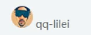     

```
img {
    vertical-align: middle;
}
```

`vertical-align : baseline | top | middle | bottom`      

- baseline：默认，元素放在父元素的基线上   
- top：
- middle：
- bottom：  
  
  


### 12.6 解决图片底部默认空隙的问题    

当用 div 包裹住 img 标签的时候，图片下面会有一个默认的空白缝隙。原因是，图片和文字默认是基线对齐，会给文字留出一部分空间

     


解决方式：   

- 设置图片的 vertical-align 属性，除了基线以外的对齐方式都行（推荐使用）    
        
  ```
  img {
      vertical-algn: middle;
      vertical-algn: top;
      vertical-algn: bottom;
  }
  ```
  
- 把图片转换成块级元素   
  原因是：只有行内元素或者行内块元素才会有 vertical-align 属性。  
  
### 12.7 溢出的文字用省略号显示   

#### 12.7.1 单行文本溢出用省略号显示    

- 先强制一行显示文本  `white-space: nowrap`  默认 normal 自动换行      
- 超出部分隐藏 `overflow: hidden`   
- 用省略号代替超出的部分 `text-overflow: ellipsis`


#### 12.7.2 多行文本溢出用省略号显示
 
多行文本溢出显示省略号，有比较大的兼容性问题，适合于 webkit 浏览器或者移动端（大部分移动端是 webkit 内核）    

```
overflow: hidden;
text-overflow:ellipsis;

/* 弹性伸缩盒子模型显示 */
display: -webkit-box;

/* 限制在一个块元素显示的文本的行数 */   
-webkit-line-clamp: 2;

/* 设置或检索伸缩盒对象的子元素的排列方式 */
-webkit-box-orient: vertical;   
```

### 12.8 常见布局技巧     

- margin 负值的运用   
- 文字围绕浮动元素  
- 行内块的巧妙运用   
- css 三角强化   
 
#### 12.8.1 margin 负值的运用    

- 场景：网页中横向排列的盒子有四个边框，如下图所示：

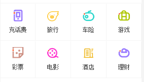   

如果给盒子设置所有边框都以 1px 形式显示出来，相邻的两个盒子都会有左右侧边框都会出来，这样相邻盒子就会拥有 2px 的边框。为了变成 1px 的左右边框，就让后面的盒子都向左移动 1px，也就是设置 `margin-left: -1px;`    

其实再设置的时候，可以让一行的所有盒子都有一个 'margin-left: -1px;' 一样可以得到很理想的效果，原因是，浏览器在进行渲染的时候，先对第一个盒子进行渲染，然后再对第二个盒子渲染，第二个盒子会浮动，这样就跟第一个盒子没有缝隙，形成 2px 的边框效果，之后再执行 `margin-left: -1px;` 这样就形成了盒子之间是 1px 的效果。    


- 如果做出鼠标经过盒子，盒子的边框就显示出来的效果，如下图：    
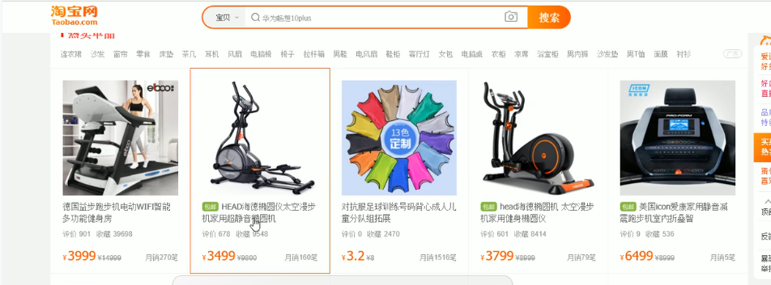

思路，直接用 hover 实现，`li:hover {border: 1px solid orange}`  
但是会出现 bug，盒子会出现，只有三个边变色。原因是什么呢？   

之前设置了盒子的浮动，而且还有 `margin-left: -1px` 这会让盒子的边框一个压着一个，所以才会出现上面的 bug。怎么解决呢？   

如果这些盒子都是普通的，没有设置 position 的盒子，让鼠标经过该盒子的时候，通过设置 position 变成相对定位,相对定位的盒子会压住标准流和浮动的盒子   

```
li:hover {
    position: relative;
    border: 1px solid orange
}
```

如果上面的方法还不能达到效果，也就是这些盒子本身已经设置了 position 属性了，就直接设置 z-index 的值 

#### 12.8.2 文字围绕浮动元素  实例没成功 换成中文字符就成功了

对于下面的这种布局，我们之前可以使用两个 div，然后设置浮动进行布局    

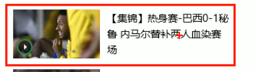   

更简单的做法是，用文字浮动     


- 准备一个大盒子，里面写文字，标准流的形式就可以   
- 在准备一个 div，里面放上 img，让这个盒子浮动即可。

p 标签不自动换行的原因
1.英文会将不包含空格、换行的连续文本认为是一个词，所以在默认情况下不换行;    
2.中文的话标点文字都是独立的，所以会自动换行;


#### 12.8.3 行内块元素的妙用    

1. 页面页码的布局效果，如下图所示     

    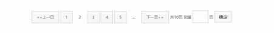   

    - 最开始想到的是，设置很多 li 元素，然后浮动，再 margin 隔开
    - 可以用行内块元素制作。行内块元素本身就可以设置大小，且相互之间有距离，还可以使用 `text-align: center` 设置居中。如果一个盒子设置了 `text-align: center` 那么里面的行内元素或者行内块元素都会居中对齐     

2. 京东首页价格制作，如下图所示：

    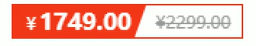    

    思路，准备两个盒子，红色的梯形和蓝色的三角形，将两者拼起来，然后将三角形设置成白色即可   
    
    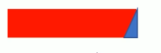   
    
    直角三角形就是两个相邻的等腰直角三角形的拼接   
    
    ```
    .trangle2 {
                margin: 40px auto;
                width: 0;
                height: 0;
                border: 100px solid transparent;
                
                border-right: 100px solid   deeppink;
    
                /* 1. 把下面的边框大小变为 0，也就是删除下边框 */
                border-bottom: 0 solid orange;
    
                /* 2. 把上面的边框变高，就可以挤得两边的三角形变高 */
                border-top: 150px solid transparent;
                
    
            }
   ```    
   
## 13、CSS 初始化    

不同浏览器对标签的默认样式不一样，为了兼容性更好，需要对 css 标签进行初始化，也成为 css reset。每个网页都必须首先进行初始化。       

```
/* 把所有标签的内外边距都设置成 0  */
* {
    margin: 0;
    padding: 0;
}

/* 斜体的文字不倾斜 */
em,
i {
    font-style: normal;
}

/* 去掉 li 的小圆点 */
li {
    list-style: none;
}

img {
    /* 为了照顾低版本浏览器，在低版本浏览器如果图片有链接，会默认有一个边框 */
    border: 0;
    /* 去掉图片下面的空白缝隙 */
    vertical-align: middle;
}

/* 按钮的鼠标样式改为小手 */
button {
    cursor: pointer;
}

/* a 连接无下划线，并更改颜色 */
a {
    color: #666;
    text-decoration: none;
}

/* 鼠标经过链接要变色 */
a:hover {
    color: #c81623;
}

/*
    统一按钮和 input 里面的字体
    "\5B8B\4F53" 意思是宋体，如果直接写汉字，浏览器在解释 css 的代码的时候可能会出现乱码的问题，
    所以就把中文字体的名称用相应的 Unicode 编码来代替。
*/

button,
input {
    font-family: "Microsoft YaHei UI", "\5B8B\4F53";
}

/* body 默认的字体、颜色 */
body {
    /* 这是 CSS3 的属性，文字放大有可能会有锯齿，设置这个属性，就不会有锯齿，让文字显示的更加清晰 */
    -webkit-font-smoothing: antialiased;
    background-color: #fff;
    font: 12px/1.5 "Microsoft YaHei UI";
    color: #666;
}

/* 清除浮动 */
.clearfix:after {
    visibility: hidden;
    clear: both;
    dispaly: block;
    content: '.';
    height: 0;
}

.clearfix {
    *zoom: 1;
}


```

## 14 HTML5  

html5 新标签和新的特性有兼容性问题，需要 IE9 及以上的浏览器才能用。html5 新增的标签更适合移动端。

### 14.1 HTML5 新增的语义化的标签    

以前的 div+css 布局，对搜索引擎不友好。新增的语义化标签有。要注意，在 IE9 中，这些新增的标签不是块元素，需要转换成块元素  
  
- `<header>` 头部标签   
- `<nav>` 导航标签  
- `<article>` 内容标签   
- `<section>` 定义文档某个区域   
- `<aside>` 侧边栏标签   
- `<footer>` 尾部标签
      

### 14.2 html5 子女证的多媒体标签  
  
- `video` 视频标签 MP4 的兼容性最好，几乎所有浏览器都支持
- `audio` 音频标签 MP3 的兼容性最好，几乎所有浏览器都支持   
这样就可以不再使用 flash 或者其他浏览器的插件     
   
`<video src="" controls="controls"></video>`

### 14.3 html5 input 标签新增了很多类型      
   
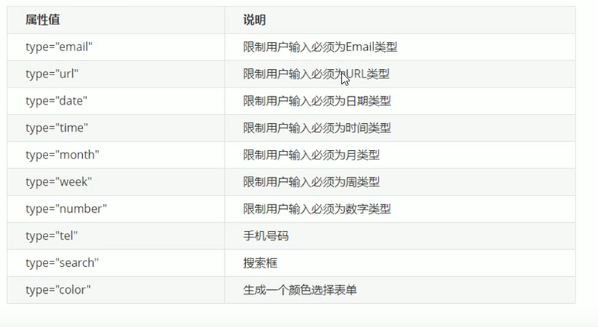   

使用的时候必须添加 form 表单域     

```
<form action="">
    <ul>
        <li>
            <input type="email">
        </li>
        <li>
            <input type="url">
        </li>
        <li>
            <input type="number">
        </li>
    </ul>
</form>
```   

### 14.5 新增的表单属性    

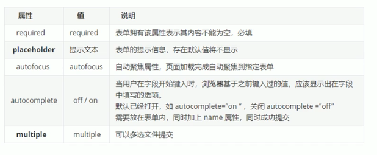   

- placeholder 里面的文字如何修改颜色和样式     

```
 input::placeholder {
      font-size: 12px;
      color: gray;
 }
```   

## 15、CSS3 新特性    

- IE9 及以上支持    
- 移动端支持的比 PC 端好
  
### 15.1 新增选择器  

- 属性选择器   
- 结构伪类选择器
- 伪元素选择器  

#### 15.1.1 属性选择器

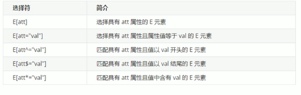

类选择器，属性选择器，伪类选择器 他们的属性都是 0010

#### 15.1.2 结构伪类选择器    
    
主要根据文档结构来选择元素，常用于根据父级选择器选择里面的子元素

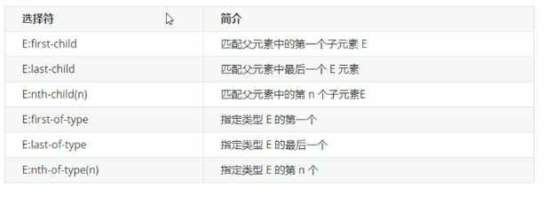   
 
- E:nth-child(n)   
  括号里面的 n 可以是数字、关键字、公式。
  
    - 数字，是几就选第几个子元素     
    - 关键字 even（偶数） odd（奇数） 制作表格的隔行变色的效果        
        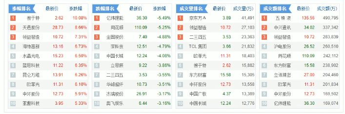     
        
    - 公式，常见的公式如下（如果 n 是公式，则从 0 开始计算，但是第 0 个元素或者超出了元素的个数会被忽略）    
    
        - E:nth-child(n)  从 0 开始，每次加 1，相当于选择了所有的孩子    
        - 其他公式    
        
          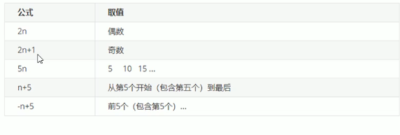    
          
- E:nth-of-type(n)             

  用法和 E:nth-child(n) 是一样的，场景上有区别  
       
    - E:nth-child(n)    
      会把所有的子元素都排上序号   
      
      ```
      section div:nth-child(1) {
          background-color: pink;
      }
      
      
      <section>
          <p>第一</p>
          <div>第二</div>
          <div>第三</div>
      </section>
      ```
         
      这样是选不出 section 里面的元素的。原因是，`section div:nth-child(1)` 首先把 section 里面的所有子元素进行排序标号，接着找到第一个子元素，最后再去匹配 div 。但是根据 html 的结构，section 的第一个子元素是 p，不是 div，因此匹配不到正确的元素。
        
    - E:nth-of-type(n) 
     
        ```
        section div:nth-of-type(1) {
            background-color: pink;
        }
        
        
        <section>
            <p>第一</p>
            <div>第二</div>
            <div>第三</div>
        </section>
        ```
    这样就会把 ”第二“ 这个元素选出来。执行的过程和 `section div:nth-child(1)` 不一样，`section div:nth-of-type(1)` 先找到 section 里面所有的 div 子元素，然后再进行排序标号。

#### 15.1.3 伪元素选择器 （重点）    
  
伪元素选择器可以通过 CSS 来创建一个新的标签，取代 html 创建标签，好处是可以简化 html 的结构。       
    
应用场景在下图，红色框内右侧的小箭头，不用新增 html 的标签实现，可以用伪元素来实现。这样使得 html 的结构更简单。

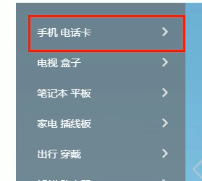
   
   
伪元素选择符：   

- `::before`  在元素内部的前面插入内容  
- `::after`  在元素内部的后面插入内容     

注意：   

- before 和 after 创建的元素，属于行内元素   
- 新创建的这个元素在文档树中是找不到的，所以才称为伪元素   
- 语法：`element::before{}`   
- before 和 after 必须有 content 属性    
- before 在父元素内容的前面创建元素，after 在父元素内容的后面插入元素    
- 伪元素选择器和标签选择器的权重一样，是 1      

伪元素应用场景：     

- 伪元素字体图标      

- 鼠标经过视频，出现黑色半透明遮罩层的效果
   
- 清除浮动       

  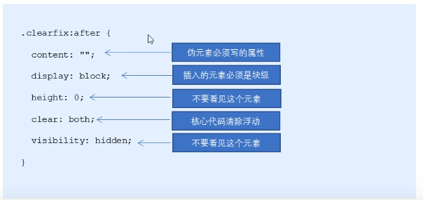    

### 15.2 CSS3 盒模型     
    
css3 以前，在设置好盒子的 width 和 height 以后，如果加上 border 会撑大盒子，加上 padding 也会撑大盒子，现在为了简化计算最终盒子的大小，css3 通过 `box-size` 属性来指定盒模型

- `box-size: content-box;` 这是默认值，盒子的大小 = content + padding + border   
- `box-size: border-box` 盒子大小就是 width，再设置 padding 和 border 的时候，也不会撑开盒子，改变盒子的大小

### 15.3 CSS3 其他特性    

- 如何让图片变模糊 filter    

  使元素模糊，或者颜色发生偏移    
  `filter：函数 （）； 例如： filter：blur（5px）；`  blur 函数起模糊的作用，数值越大，越模糊

- 计算盒子宽度 width:calc 函数
  
  `width: calc(100%-80px);`     
  
  
- css3 过渡动画特性  transition    

    - 使用方法
        经常和 `：hover` 一起搭配使用
        
        `transition：要过度的属性 花费时间 运动曲线 何时开始`  
   
        - 属性：想要变化的 css 属性，宽度高度 背景颜色 内外边距  。如果想要所有的属性都有变化过度，写一个 all 就可以
        - 花费的时间：单位是秒  
        - 运动曲线：默认是 ease (可以省略)
        - 何时开始：单位是秒，可以设置延迟出发的时间，默认是 0s （可以省略）
  
          ```
          div {
              width: 200px;
              height: 100px;
              background-color: pink;
              transition: width 1s;
          }
          div:hover {
              width: 300px;
          }
          ```   
          要注意 transition 写的位置，那个元素需要变化，就写那个元素，然后结合 `:hover` 来实现鼠标经过，触发动画过渡的效果。如果想要多个属性进行过渡动画，用逗号隔开，例如：`transition: width 1s, height 1s;`        
  
    - transition 应用案例——进度条（购物网站秒杀进度条）
      
      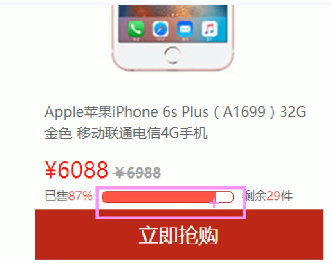
     
    思路分析：实际上是由父盒子和子盒子构成，随着你秒杀数量的增多，父盒子不变，子盒子逐渐变大。   
    
## 16、品优购项目练习     

### 16.1 网站制作流程       

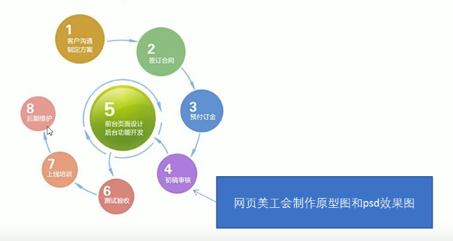
       
### 16.2 favicon 图标    

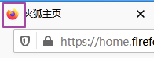    

favicon 图标就是打开网页时，网页标签栏最前面的图标     

- 制作 favicon 图标  

    - 把图标用 ps 切成 png 图片
    - 把 png 图片转换成 ico 图标，这需要第三方转换网站，比如 比特虫：http://www.bitbug.net
    
- 将做好的 favicon 图标放在网站的根目录下   
    
- html 引入 favicon 图标
    
    在 head 标签里面引入： `<link rel="shortcut icon" href="favicon.ico" type="image/x-icon"/>`
          
### 16.3 网站 TDK 三大标签 SEO 优化     

SEO 的目的是对网站做深度的优化，从而帮助网站获取免费的流量，进而在搜索引擎上提高搜索排名。    

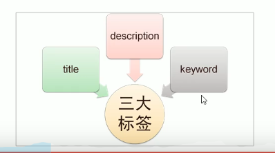

- title 网站标题    
  title 具有不可替代性，是网页第一个重要的标签，是搜索引擎了解网页的入口和对网页主题归属的最佳判断点。网站名-网站介绍，不要超过30字   
  
- description 网站说明    
  主要说明网站是做什么的      
  
- keywords 关键字    
  keywords 是页面关键词，是搜索引擎的关注点之一    
  
 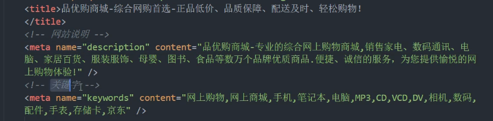    
 
### 16.4 盒子之间小竖线的做法   

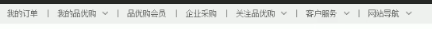
  
小竖线用li元素这个盒子来做，设置 li 的宽高margin值   

# 该看308集      


## 17、css3 2D转换 transform   

转换（transform）是 css3 中最具有颠覆性的特征之一，可以实现元素的位移、旋转、缩放等效果     

- 移动：translate  `transform： translate(x, y)`   

    - 不会影响其他元素的位置
    - 百分比是相对自身元素的比例去移动 应用场景，当鼠标经过，盒子会向上移动一丢丢，但不能影响其他区元素的布局
    - 对行内标签没有效果   
    - 实现垂直居中: 向下移动父元素宽度的一半，在向上移动自身高度的一半   
    
        ```
            
        ```

- 旋转：rotate `transform: rotate(度数)` 在二维坐标下顺时针或者逆时针进行旋转   

    - 度数必须加单位 deg  `ratate(45deg)`
    - 正数是顺时针，负数是逆时针  
    - 默认旋转中心就是元素中心 `transform-origin: x  y` 设置旋转中心。默认是 50% 和 50%，也就是 center，center。可以使用 left、right、top、bottom、center 来调节中心点

- 缩放：scale `transform: scale(x, y);` 参数是不带单位的数字，意思是原来的多少倍    

   要注意 这种方式的缩放和直接修改 width、height 的区别：这种缩放不会影响其他兄弟盒子的布局，而且可以修改缩放的中心点。向后者缩放会影响页面其他盒子的布局。   
   


  
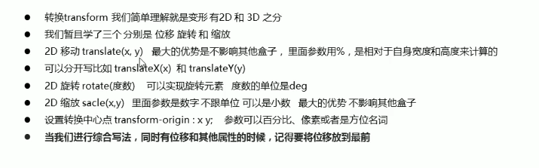    
    
## 18、css 动画      

动画（animation）是 CSS3 中具有颠覆性的特征之一，可通过设置多个节点来精确控制一个或一组动画，常用来实现复杂的动画效果。相比较过渡，动画可以实现更多变化，更多控制，连续自动播放等效果       

### 18.1 动画的基本使用    
   
制作动画分为两步：先定义动画，再调用动画。     

- 定义动画 使用 keyframes 来定义动画（类似定义类选择器）   
    ```
        @keyframes 动画名称 {
            0% {
                 width: 100px;
            }
            100% {
                 width: 200px;
            }
        }
    ```
    - 0% 是动画的开始，100%是动画的完成，这样的规则就是动画序列。或者用 from 和 to 来代替 0% 和 100%     
    - 在 @keyframes 中规定某项 css 样式，就能创建由当前样式逐渐改变为新样式的动画效果    
    - 动画是使元素从一种样式逐渐变换到另外一种样式的效果，可以改变任意多的样式，任意多的次数
  
- 使用动画，调用动画    

   ```
       div {
            /* 调用动画 */
            animation-name: 动画名称；
            /* 持续时间 */
            animation-duration：持续时间；
       }
   ```   
   
### 18.2 动画属性     

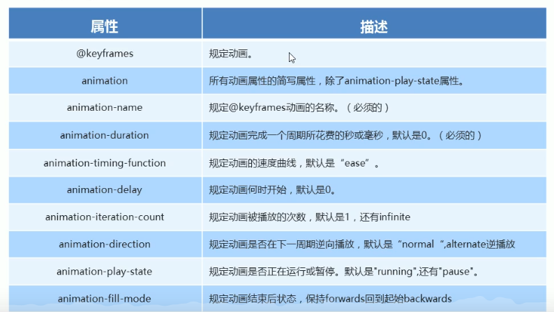   
  


  

