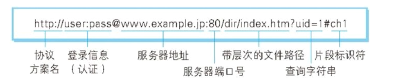

# 一、浏览器输入 url 后 http 请求返回的完整过程    

目的，明白在地址栏输入 url 到得到页面的过程是什么？

## 一. 网络协议分层

应用层（HTTP, FTP），传输层(TCP,UDP)，网络层，数据链路层，物理层

## 二. http 发展历史

#### 2.1 http0.9

- 只有一个 get 方法；
- 没有 header 等描述数据的信息；
- 服务器发送完毕就关闭 tcp 连接。也就是说每发送一次 http 请求，就要建立一次 tcp 连接，开销较大。

#### 2.2 http 1.0

- 增加了很多命令：post，put，head
- 增加了 status 状态码和 header 头部信息内容
- 多字符集支持，多部分发送，权限，缓存等

- 依然有这个缺点：服务器发送完毕就关闭 tcp 连接。也就是说每发送一次 http 请求，就要建立一次 tcp 连接，开销较大

#### 2.3 http1.1

- 支持了持久连接：一个 tcp 连接支持多个 http 请求。在HTTP1.1中默认开启Connection： keep-alive，一定程度上弥补了HTTP1.0每次请求都要创建连接的缺点。
- pipeline：一个 tcp 连接支持多个 http 请求，发送多个 http 请求的时候，不管服务器对前一个http请求有没有做出应答，都可以发送后一个请求。但是服务器接收到很多http请求的时候，是按照每个 http 请求的顺序做出应答的。也就是说，如果前一个 http 请求的处理时间非常慢，后一个 http 请求处理的时间非常快，后一个 http 请求的应答也必须等前一个 http 请求处理完才能处理。
- 增加了 host 和其他命令。增加了 host 好处是，我们在同一个物理服务器上可以部署不同的 web 服务，比如在一个物理服务器，可以有一个 node 服务和一个 java 服务，加上了 host，就可以区分出，我们要请求的的 node 服务还是 java 服务。这样就可以提高物理服务器的使用效率
 
#### 2.4 http2

目前还没有普及

- 所有数据以二进制和帧的形式传输，同一个链接里面发送多个请求，不需要按照顺序。http1.1 数据以字符串的形式传输
- 针对 http 1.1 的 pipeline 进行优化。HTTP 2多个请求可同时在一个连接上并行执行。某个请求任务耗时严重，不会影响到其它连接的正常执行。http 1.1 发送并行，接收串行。某个请求的响应时间过长，会影响后面的请求响应，出现线头阻塞。
- 头信息压缩：这样数据体积小了，在网络上传输就会更快。
- 服务器推送：当我们对支持 HTTP2.0 的 web server 请求数据的时候，服务器会顺便把一些客户端需要的资源一起推送到客户端，免得客户端再次创建连接发送请求到服务器端获取。这种方式非常合适加载静态资源。 web 页面都会有 js 和 css 文件，他们都是以链接的方式在 html 的文本信息里面显示的，通过浏览器解析后，根据链接里面的 url 地址再去请求对应的 js 和 css 文件，这里面就会包含顺序的问题，需要先请求 html 的文本，在浏览器解析运行这个文本以后，才能去发送 css 请求和 js 请求，http2 在解析 html 的同时，就可以把 这个页面所需要的 js 和 css 推送给浏览器  

## 三. tcp 三次握手

    

  

### 为什么需要三次握手？   

如果采取两次握手，相当于第二次握手结束便建立连接，如果发送SYN的一方不想连接了，也不会有反馈，另一方却一直在等待，浪费了时间。当然可以采取4次甚至N次握手，但是有必要吗？建立连接的时间太长，效果也会大打折扣。所以3次只是折中方案，保证了可靠性，又节俭了建立连接的时间。

## 四. URI URL URN

- URI 统一资源标志符 包含 url 和 urn

- URL 统一资源定位器    

        
   
   - 协议有很多，比如：https，ftp，mailto（给一个邮件地址去发送邮件）他们定义以怎样的解析方式和协议去访问这个资源，也就是说定义了发送方如何传输数据，接收方如何去解析数据 
   - 登陆信息认证，目前很少用到这种方式去做用户的认证，现在有更好的方式去做认证。因为如果每一次都在 url 里面传输用户名和密码，这是即麻烦又不安全的操作。这一块只是 url 在定义的时候，留给用户的一个区域
   - 服务器地址：用于定位我们请求的资源在互联网中的位置。这里可以是 ip 可以是 域名，如果是域名，需要经过 DNS 解析成 ip，然后才能定位到服务器的位置
   - 服务器的端口：为什么要有端口呢？每一台服务器都有很多端口，在一个服务器上可以跑很多的软件服务，每个服务可以监听不同的端口。如果我们要找的是这台物理服务中的某个 web 服务存放的资源，就需要指定我们要哦找的是哪一个 web 服务。也就是说，端口就是用来定义 host 找到的那个物理服务器上存放的许多个 web 服务器中的某个 web 服务。因为整个 http 协议就是用来定位的。我们先找到 物理服务器，然后找到 web 服务器，然后根据 url 后面的内容，找到我们需要的资源，就是一点一点的精确搜索范围。常用的正式上线的 web 服务的后面是不带端口的，默认就是访问 80 端口，因为端口不便于用户记忆，所以正式发布的时候只有域名，然后使用默认的 80 端口
    - 带层次的文件目录：称为 path 或者 路由。从定义来讲，这部分应该就是我们部署的 web 服务的路径，但是现在 web 应用越来越复杂，很多数据是存在数据库中的，并不是对应某个磁盘上面的文件，所以更多时候是把他用来辨别我们要请求的数据，直接在程序里面判断，而不是用来确认资源的路径
    - 查询字符串：传参     
    - 片段标识符：# 前面的部分表示根据这个 url 找到了一个文档，但是这个文档如果很大，我们只想看某一个片段，不想要让他全部返回，那么用这个字段就可以表示文档中的某一个片段。目前在做前端开发的时候，会用这个来做一个锚点定位的工具

- URN 永久统一资源定位符，在资源移动之后还能被找到，目前还没有一个成熟的使用方案和场景

## 五. http 报文
header 和 body 中间用一行空行隔开
- 请求报文：请求行，请求头部，请求体    
请求行：请求方法，url（一般是路由），http 版本

- 响应报文：响应行，响应头部，响应体   
响应行：http 版本，状态码，状态说明

#### 1. http 常用方法
- get 
- post 创建数据
- head
- put 更新数据 修改数据
- delete
- options

#### 2. http 状态码

- 301 是永久重定向，比如第一次输入一个 a 地址，要跳到 b 地址，如果服务器返回的状态码是 301， 前端就会觉得这个 b 地址一直会存在，就会把 b 地址缓存，等到第二次再次输入 a 地址的时候，就不会再向服务器发送请求，直接跳到 b 地址    
- 302 临时重定向，比如还是上面的场景，但是 服务器返回的状态码是 302，因为是临时重定向，不知道下次要重定向到哪里，所以不会缓存，下次访问 a 地址，还是会向服务器发送请求，去请求 a
- 304 缓存有关，表明服务器的资源没有发生变化，可以使用缓存 

- 500 服务器内部错误，可能是代码错误
- 503 服务器临时错误，可能是请求的内容太多，服务器临时挂了，可能一会就好了

#### 3. post 和 get 区别

- get  
    - 把数据放在 url 中，不安全，也有数据大小的限制，适合传送小量的数据。，HTTP 协议没有 Body 和 URL 的长度限制，对 URL 限制的大多是浏览器和服务器的原因。服务器是因为处理长 URL 要消耗比较多的资源，为了性能和安全（防止恶意构造长 URL 来攻击）考虑，会给 URL 长度加限制。  
    
    - 侧重从服务器中取数据。由于GET请求一般是用于资源信息的获取而非修改，换言之，GET请求一般不会产生副作用，它仅仅是获取资源信息，就像数据库查询一样，不会改变数据，不会影响资源的状态。所以，GET请求不一般会改变服务器状态。幂等意味着对于同一个URL的多个请求应该返回同样的结果。
    
    - get 请求可以缓存

- post
    
    - 数据放在请求体中传送，安全，适合传送较大的数据。    
    
    - 侧重把数据发送到服务器，跟新后台数据库中的数据
    
    - post 请求不能缓存
   
然而，从传输的角度来说，get 和 post 都是不安全的，因为 HTTP 在网络上是明文传输的，只要在网络节点上捉包，就能完整地获取数据报文。要想安全传输，就只有加密，也就是 HTTPS

#### 4. 认识 http 客户端    
可以接受 http 的请求
- 浏览器：最常用的 http 客户端
- crul
- 爬虫

#### 4. http 和 https 的区别

#### http 缺点

加密处理防止被窃听：加密的对象可以有这么几个
通信的加密：    
- 一种方式就是将通信加密。HTTP 协议中没有加密机制，但可以通过和 SSL（Secure Socket Layer，安全套接层）或TLS（Transport Layer Security，安全层传输协议）的组合使用，加密 HTTP 的通信内容。用 SSL 建立安全通信线路之后，就可以在这条线路上进行 HTTP通信了。与 SSL 组合使用的 HTTP 被称为 HTTPS（HTTPSecure，超文本传输安全协议）或 HTTP over SSL。    

- 内容的加密：还有一种将参与通信的内容本身加密的方式。由于 HTTP 协议中没有加密机制，那么就对 HTTP 协议传输的内容本身加密。即把HTTP 报文里所含的内容进行加密处理。在这种情况下，客户端需要对 HTTP 报文进行加密处理后再发送请求。为了做到有效的内容加密，前提是要求客户端和服务器同时具备加密和解密机制。主要应用在 Web 服务中。有一点必须引起注意，由于该方式不同于 SSL 或 TLS 将整个通信线路加密处理，所以内容仍有被篡改的风险。

不验证通信方的身份就可能遭遇伪装：任何人都可发起请求在 HTTP 协议通信时，由于不存在确认通信方的处理步骤，任何人都可以发起请求。另外，服务器只要接收到请求，不管对方是谁都会返回一个响应（但也仅限于发送端的 IP 地址和端口号没有被 Web 服务器设定限制访问的前提下）。HTTP 协议的实现本身非常简单，不论是谁发送过来的请求都会返回响应，因此不确认通信方，会存在以下各种隐患。  

- 无法确定请求发送至目标的 Web 服务器是否是按真实意图返回响应的那台服务器。有可能是已伪装的 Web 服务器。   

- 无法确定响应返回到的客户端是否是按真实意图接收响应的那个客户端。有可能是已伪装的客户端。    

- 无法确定正在通信的对方是否具备访问权限。因为某些Web 服务器上保存着重要的信息，只想发给特定用户通信的权限。    

- 无法判定请求是来自何方、出自谁手。
即使是无意义的请求也会照单全收。无法阻止海量请求下的 DoS 攻击（Denial of Service，拒绝服务攻击）。

### http缺点：   
  
- 通信使用明文（不加密），内容可能会被窃听
- 不验证通信方的身份，因此有可能遭遇伪装
- 无法证明报文的完整性，所以有可能已遭篡改

### https

HTTP 加上加密处理和认证以及完整性保护后即是HTTPS

- https协议需要到ca申请证书，一般免费证书较少，因而需要一定费用。   
- http是超文本传输协议，信息是明文传输，https则是具有安全性的ssl加密传输协议。   
- http和https使用的是完全不同的连接方式，用的端口也不一样，前者是80，后者是443。   
- http的连接很简单，是无状态的；HTTPS协议是由SSL+HTTP协议构建的可进行加密传输、身份认证的网络协议，比http协议安全。
    

#### 5. 什么时候用 http，什么时候用 https

和上面的一样

#### 6 websocket 和 http 区别

- http    
http链接分为短链接，长链接，短链接是每次请求都要三次握手才能发送自己的信息。即每一个request对应一个response。长链接是在一定的期限内保持链接。保持TCP连接不断开。客户端与服务器通信，必须要有客户端发起然后服务器返回结果。客户端是主动的，服务器是被动的。

- websocket   
WebSocket他是为了解决客户端发起多个http请求到服务器资源浏览器必须要经过长时间的轮训问题而生的，他实现了多路复用，他是全双工通信。在webSocket协议下客服端和浏览器可以同时发送信息。   
建立了WenSocket之后服务器不必在浏览器发送request请求之后才能发送信息到浏览器。这时的服务器已有主动权想什么时候发就可以发送信息到服务器。而且信息当中不必在带有head的部分信息了与http的长链接通信来说，这种方式，不仅能降低服务器的压力。而且信息当中也减少了部分多余的信息。  
WebSocket优势： 浏览器和服务器只需要要做一个握手的动作，在建立连接之后，双方可以在任意时刻，相互推送信息。同时，服务器与客户端之间交换的头信息很小

## 六、跨域   

## 1. 什么是同源策略？

- 同源策略限制了从同一个源加载的文档或脚本如何与来自另一个源的资源进行交互。这是一个用于隔离潜在恶意文件的重要安全机制。

- 定义：两个页面的协议，端口（如果有指定）和主机（域名）都相同，则两个页面具有相同的源。网址中没有写端口，http 就默认 80，https 默认是 443。

## 2. 非同源会怎么样？

- cookie，localStorage，indexDB 无法读取

- DOM 无法获得

- AJAX 请求无法发送

## 3. 为什么需要同源策略？

如果没有同源策略，网站就有可能会遭到 CSRF 和 XSS 攻击。

### 3.1 CSRF 跨站请求伪造

- **理解什么是 CSRF:**  
攻击者盗用了用户的身份，以用户的名义向网站发送了恶意请求。比如：以用户的名义发送邮件，发送消息，转出资金，购买商品等，造成个人隐私泄露，危害财产安全。

- **CSRF 的简单原理：**   
图片：

- **CSRF 的防御：**   

如果存在同源策略，由于主机不一样或者端口号不一样，B 无法取得 C 的 cookie 信息来伪装成 C，也就不能以 C 的名义向 A 发送请求了。   
  
  CSRF 可以从客户端和服务器端两个方面进行防御，但一般服务器段进行防御效果会好一些。   
  
  - 服务器端的防御：
  1. 验证 HTTP Referer 字段：  
  根据 HTTP 协议，在 HTTP 头中有一个字段叫 Referer，它记录了该 HTTP 请求的来源地址。Referer标识当前请求的来源页面，浏览器访问时除了自动带上Cookie还会自动带上Referer，所以服务端可以检测Referer头是否本网站页面来决定是否响应请求。因此，要防御 CSRF 攻击，网站只需要对于每一个请求验证其 Referer 值，如果是以 bank.example 开头的域名，则说明该请求是来自银行网站自己的请求，是合法的。如果 Referer 是其他网站的话，则有可能是黑客的 CSRF 攻击，拒绝该请求。  
  2. 在请求地址中添加 token 并验证：   
  在 url 中新增一个 token 值，这个 token 值是随机的、不可预测的:https://host/path/delete?username=abc&item=123456&token=[random(seed)]。token值为用户和服务器所有，这个值可以放在服务器的session中，或者浏览器的cookie中。有token值时，用户提交请求，服务器只需要验证表单中的token与用户session(或cookie)中的token值是否一致即可。由于攻击者无法再构造出一个完整的URL，那么CSRF攻击就无法实施。
  
   - 浏览器端的防御：
   还未找到资料。
   
### 3.2 XSS 跨站脚本攻击

- 理解什么是 XSS    
指攻击者在网页中嵌入客户端脚本(例如JavaScript), 当用户浏览此网页时，脚本就会在用户的浏览器上执行，从而达到攻击者的目的.  比如获取用户的Cookie，导航到恶意网站,携带木马等。

- XSS 的原理   
XSS之所以会发生， 是因为用户输入的数据变成了代码。

- XSS 的防御    
对用户输入的数据进行HTML Encode处理。 将其中的"中括号"， “单引号”，“引号” 之类的特殊字符进行编码。

## 4. 跨域  

针对非同源产生的三种限制结果，    
- cookie，localStorage，indexDB 无法读取
- DOM 无法获得
- AJAX 请求无法发送   
    
产生了针对这三种限制结果的跨域方案：

### 4.1 针对由于同源策略产生的 cookie，localStorage，indexDB 无法读取的解决方案：

#### 1. 通过设置相同的`document.domain`跨域获取 cookie：
  
只有同源的网页才能共享 cookie，但是，两个网页一级域名相同，只是二级域名不同，浏览器允许通过设置document.domain共享 Cookie。   
    
举例来说，A网页是http://w1.example.com/a.html，B网页是http://w2.example.com/b.html，那么只要设置相同的document.domain，两个网页就可以共享Cookie。`document.domain = 'example.com';` 现在 AB 两个网页可以共享 cookie 了。   
   
但要注意，LocalStorage 和 IndexDB 无法通过这种方法，规避同源政策，而要使用下文介绍的PostMessage API

#### 2. 服务器指定 cookie 所属的域名为一级域名

服务器也可以在设置Cookie的时候，指定Cookie的所属域名为一级域名，比如.example.com。`Set-Cookie: key=value; domain=.example.com; path=/` ，这样的话，二级域名和三级域名不用做任何设置，都可以读取这个Cookie。

### 4.2 针对由于同源策略使得不同源之间的 DOM 无法获取的解决方案：

典型的例子是iframe窗口和window.open方法打开的窗口，它们与父窗口无法通信。

### 4.3 针对由于同源策略 AJAX 无法跨域请求数据的解决方案：

有四种解决方案：   
- 服务器代理
- JSONP
- WebSocket
- CORS

#### 1. 服务器代理

#### 2. JSONP

- 概述：  
用 `<script>` 标签来完成获取数据的工作。script 是用来包裹代码的，并且浏览器允许 script 的 src 属性跨域请求资源，那么我们就可以把需要的数据放在 script 标签中，完成跨域的数据传输。

- 网页通过添加一个`<script>`元素，向服务器请求JSON数据，这种做法不受同源政策限制；服务器收到请求后，将数据放在一个指定名字的回调函数里传回来。具体过程可以参看 headfirst of html5 P278、P279。

- 优点是：老浏览器全部支持，服务器改造小。   
缺点是：JSONP 只能发 GET 请求。想要发 POST 请求，可以用 

用 img 标签 src 属性跨域需要注意的是服务器会默认的要求我们必须真实的传递一张图片，否则请求会失败，解决方案是做个1*1px的透明图过去给服务器即可。
  
原理是相同的，都是利用标签的src属性可以跨域请求的特点，但是具体的实现不同。使用img标签不能访问服务器返回的响应内容，也就是说只能单向的发送get请求；而使用script标签实现的jsonp跨域可以将服务器响应文本以函数参数的形式返回，浏览器解析js代码时直接就执行了。

#### 3. WebSocket

WebSocket protocol是HTML5一种新的协议。它实现了浏览器与服务器全双工通信，同时允许跨域通讯，是server push技术的一种很好的实现，使用ws://（非加密）和wss://（加密）作为协议前缀。该协议不实行同源政策，只要服务器支持，就可以通过它进行跨源通信。   
浏览器发出的WebSocket请求的头信息有一个字段是 Origin，表示该请求的请求源（origin），即发自哪个域名。   
正是因为有了Origin这个字段，所以WebSocket才没有实行同源政策。因为服务器可以根据这个字段，判断是否许可本次通信。如果该域名在白名单内，服务器就会做出回应。      
原生WebSocket API使用起来不太方便，我们使用Socket.io，它很好地封装了webSocket接口，提供了更简单、灵活的接口，也对不支持webSocket的浏览器提供了向下兼容。

#### 4. CORS

CORS是跨源资源分享（Cross-Origin Resource Sharing）的缩写。它是W3C标准，是跨域 AJAX 请求的根本解决方法。相比JSONP只能发GET请求，CORS允许任何类型的请求。    
  
 自定义的头在跨域请求的时候是不被允许的，即使设置了 Access-Control-Allow-Origin     
 
 - 简单请求
 
    - 跨域默认允许的方法：GET、HEAD、POST。除了这三个之外的 PUT DELETE 需要预检验，或者叫预请求。
 
    - 跨域允许的 Content-Type ： text/plain  ; multipart/form-data ; application/x-www-form-urlencoded    他们三个是在 html 中的 form 表单可以设置的数据类型。除了这三种之外的，也需要预请求
       
              
      
    - 跨域允许的请求头：    
    
上面的是简单请求，除了简单请求之外就是非简单请求，非简单请求要在发送请求之前，进行一次 origin 预检验，预检请求的请求方法是 OPTIONS，在浏览器中的 network 中会有一个 `Request Method
: OPTIONS`，表示用来询问的，获取浏览器发送 post 请求的允许。

 - 非简单请求 
    
    - 自定义请求头部字段再发送请求   
    如果浏览器地址栏输入的是 server 的地址，server 服务器返回给前台的 html 中有一段 ajax 的请求代码，要请求 server2 这个服务器的内容，server2 服务器的 Access-Control-Allow-Origin 的值是 * 。此时，若在 ajax 请求发送的时候，设置一个自定义的请求头部字段，`"X-Text" : "123"`，一起向 server2 发送请求的时候，会发生跨域的现象，server2 不会发送给客户端正确的信息，但是还是会有一个 200 的状态码返回。    
    解决方案：在 server2 服务器里面设置一个 Access-Control-Allow-Headers 字段的值是前面 AJAX 里面定义的自定义头部字段的名字  `"Access-Control-Allow-Headers": "X-Text"`。
 
 - 设置允许的请求方法 Access-Contrl-Allow-Method    
 像上面的 Access-Contrl-Allow-Headers 一样，若后端想允许别的请求方法来请求资源，需要在后端设置 ： `"Access-Control-Allow-Method": "PUT, DELETE"`  
 
 - Access-Contrl-Max-Age: '1000'   
 以前面的设置项跨域的所允许的最长时间。1000 秒内，都不需要发送预请求验证了，直接发起正式请求就可以了。超过这个期限，再发送预检请求。
 
浏览器一旦发现AJAX请求跨源，就会自动添加一些附加的头信息，有时还会多出一次附加的请求，但用户不会有感觉。

- 总结：   
简单请求和非简单请求都会发送 origin 字段，标识请求方的源信息(协议域名端口号)。简单请求和非简单请求的区别在于：非简单请求会发送两次请求。
    - 第一次请求是预检请求，请求方法是 OPTIONS，请求的头部字段还有 `origin` ,`Access-Control-Request-Headers` 和`Access-Control-Request-Methods` 他们的值分别是本次发起请求的自定义头部名称和本次的请求方法。目的是，把这些信息发送到后端去验证，具体是和后端的 `"Access-Control-Allow-Headers"`  和 `"Access-Control-Allow-Method" ` 比较值是否相同，相同就允许跨域，不同就不允许跨域。  
    而简单请求只发一次请求，浏览器会帮助我们自动把请求头的信息补全，请求头只有 `origin` 字段，他的值是本次请求的源。发送到后台服务器，和后台服务器的 `Access-Control-Allow-Origin` 的值对比来决定是否允许跨域请求。若允许，就会在返回的响应头中加入这个字段的信息 `Access-Control-Allow-Origin`。若不允许，就不返回这个字段。
    - 非简单请求的第二次请求：  
    如果浏览器否定了"预检"请求，会返回一个正常的HTTP回应，但是没有任何CORS相关的头信息字段，返回的状态码是200，因此我们不能通过状态码来判断是否跨域请求成功。可以根据是否有返回的和 CORS 有关的请求头信息来看是否跨域成功。返回了与 CORS 相关的请求头信息，就允许跨域；没有返回与 CORS 相关的请求头信息，就不允许跨域。   
    一旦服务器通过了"预检"请求，以后每次浏览器正常的CORS请求，就都跟简单请求一样，会有一个Origin头信息字段。服务器的回应，也都会有一个Access-Control-Allow-Origin头信息字段。一旦通过预检请求以后，一般会再设置一个 `Access-Control-Max-Age` 字段的值，使得一段时间内，不需要进行预检请求，直接发送带 `origin：源` 字段的正式请求即可。

## 七、http 缓存机制

http缓存主要针如css，js，图片等更新频率不大的静态文件。

常用头部字段：

- cache-ctrol：  
 
    该字段的取值
   
    能否缓存：
    - public：http 请求返回的内容经过的路径中，包括中间的 http 代理服务器，以及发出请求的客户端浏览器，都可以对返回的内容进行缓存 
    - privite：仅发起请求的浏览器可以缓存
    - no-cache：任何节点都不能进行缓存，其实是可以在服务器和本地进行缓存，但是每次发请求都要向服务器验证一下，如果服务器返回的请求告诉我们，可以用本地的缓存，然后我们才能使用本地的缓存，如何验证后面学习
    
    缓存时间：
    - s-max-age：设置代理服务器的缓存时间
    - max-age：多少秒以内缓存是有效的，超过这个时间，浏览器发送的请求就不再从缓存中读取了，会直接向服务器请求
    - max-stale：即便缓存已经过期了，只要在这个设置时间之内是可以读取过期的缓存文件。是发起请求这一方主动带的头部字段
    
    重新验证：不经常用
    - must-revalidate：
    - proxy-revalidate：
    
    其他：
    - no-store：彻底的，本地和服务器都不能使用缓存，永远都要去服务器获得新的数据才行
    - no-transform：告诉缓存服务器不要随意改动从服务器请求的内容，比如不要压缩。
     
当服务器设置响应头部字段 `"cache-contorl" ： "max-age=60*60*24" ` 意思是在一天之内进行缓存。这本来是一个前端优化，提升用户体验。但是设置了这个值以后，如果在这一天之内服务器的资源修改了，浏览器也不会更新资源，依旧会使用本地缓存，这是我们不愿意看到的。解决方案就是：服务器在后端打包文件的时候，对于静态资源的文件名设置成文件名加上一个 hash 值。这个 hash 值是根据文件内容生成的唯一值，当内容变化时，hash 也会变化。这样就可以控制 html 文件中 script 中 src 属性的值，当 scr 属性值变化的时候，也就是路径发生变化的时候，页面请求的就是一个新的资源，而不是原来的资源，就不会使用缓存的资源。这样就可以根据这个值变不变化来决定是否要用缓存文件。这是业内普遍的解决方案。

- Last-Modified：上次修改的时间，在服务器端设置。配合 浏览器的 If-Modified-Since 和 If-Unmodified-Since 使用。

- Etag：通过数据签名，对资源的内容产生一个唯一的签名。一般是对资源的内容进行哈希计算。与 If-Match 和 If-None-Match 配套使用。

## 八、cookie 和 session

- cookie   
cookie 是服务器在返回消息给浏览器的时候，通过 Set-Cookie 来保存到浏览器中的一些内容，设置多个 key value 值用数组。下一次 http 请求的时候，会自动带上 cookie。它是以键值对的形式进行保存的，可以设置很多个。   
cookie的属性：
    - max-age 和 Expires 用来设置 cookie 的过期时间。如果没有设置 max-age 或者 Expires，那么刷新页面 cookie 就没有了。再过有效期内，下一次请求会带上这个 cookie，超过这个有效期，下一次请求就不会带上这个 cookie
    - Secure 用来设置 只有在 https 请求的时候才会带上 cookie。http 请求的时候不会带上 cookie。
    - 设置了 httpOnly，cookie 就无法通过 javascript 里面的 document.cookie 来访问 cookie 的内容。这样做可以防止 XSS 攻击。出于安全考虑，要禁止重要的数据被 js 脚本访问  
    - 同一个域名下，cookie 可以相互访问，不同域名下，不能相互访问。不同域名下也不能设置  cookie。在一个一级域名下设置 cookie， 通过  `domain="text.com"` ，那么 text.com 一级域名下的子域名可以访问到 cookie。cookie 跨域是忽略协议和端口
     
    
- session      
使用 cookie 来保存 sessionId 

# 九、http 长连接

# 十、数据协商

- 请求：

    - Accept：指定客户端想要的数据类型，也就是浏览器的可以接受可以展示的数据
    - Accept-encoding：数据的编码方式
    - Accept-language：支持展示的语言
    - User-Agent：浏览器的相关信息
    
- 响应

    - Content-Type： 返回的数据格式
    - Content-encodeing：服务端用的编码方式
    - Content-language：
    
# 十一、redirect  

302 和 301 的区别：场景，将 url 重定向到 url2

- 301：永久重定向，设置了 301 之后，浏览器端输入 url1，直接访问重定向的路径 url2。因为是永久重定向，所以 301 会使得浏览器尽可能长的时间去缓存。要慎重去用。一旦设置了 301，除非用户清空缓存，否则一只会从缓存里面加载。
- 302：临时重定向，设置了 302 之后，浏览器先访问 url1，再重定向到 url2.

# 十二、Content-Security-Polity： 内容安全策略  

# 十三、Nginx   

- 安装

# 十四、proxy 网络代理    
## 14.1 网络代理工具    
- Charles: 开源
- Fiddler: 开源
- Hiproxy: 公司自己弄的

