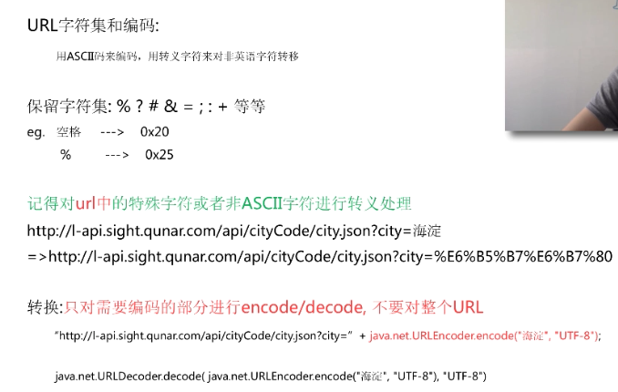
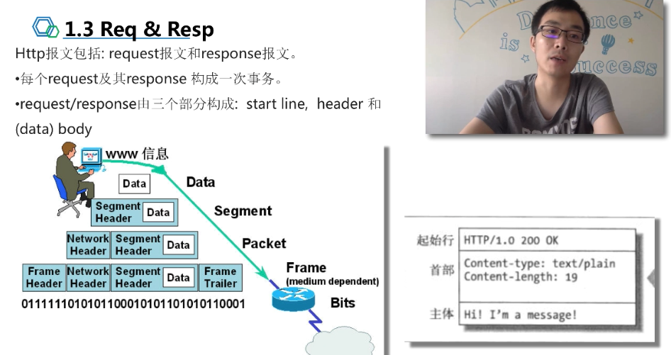
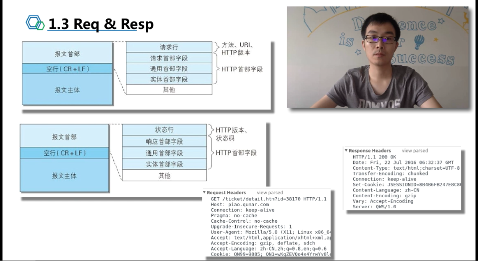
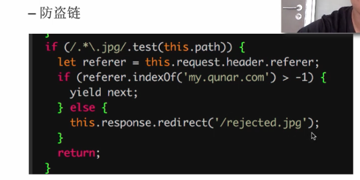
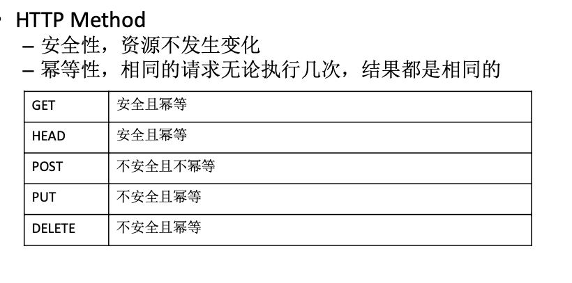
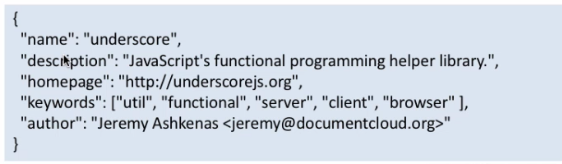

# http    
## 一、http protacal     

### 1.1 introduce   

### 1.2 URI

- URL 的构造      
    

- URL 的字符集和编码        
        

### 1.3 Req & Resp

       
   
- 请求头和响应头的结构      

            
    
- HTTP请求头   

    - Host:初始URL中的主机和端口
    - Accept:浏览器可接受的MIME类型
    - Accept-Charset:浏览器可接受的字符集
    - Accept-Encoding:浏览器能够进行解码的数据编码方式，比如gzip。
    - Accept-Language:浏览器所希望的语言种类
    - Connection:表示是否需要持久连接。因为建立 tcp 链接比较耗费资源，所以告诉服务器不要断开哦，希望能一直保持链接
    - Content-Length:表示请求消息正文的长度。
    - Cookie:Cookie字符串
    - Referer:包含一个URL，用户从该URL代表的页面出发访问当前请求的页面。
    
        - 防盗链     
               
            
        - 网站流量来路统计        
        
            
        
    - User-Agent:浏览器类型，如果Servlet返回的内容与浏览器类型有关则 该值非常有用。
    
- HTTP响应头
  - Access-Control-Allow-Origin: 指定哪些站点可以参与跨站资源共享，和 ajax 相关
  - Content-Length: 响应体的字节长度
  - Content-Type: 设置响应体的MIME类型，
  - Date: 消息发送的日期和时间，服务器的时间
  - Server: 服务器名称
  - Set-Cookie: 设置HTTP Cookie
  - Transfer-Encoding 设置传输实体的编码格式，目前支持的格式: chunked, compress, deflate, gzip, identity

            
    
  

- 状态吗：    

    - 301 是永久重定向，比如第一次输入一个 a 地址，要跳到 b 地址，如果服务器返回的状态码是 301， 前端就会觉得这个 b 地址一直会存在，就会把 b 地址缓存，等到第二次再次输入 a 地址的时候，就不会再向服务器发送请求，直接跳到 b 地址    
    - 302 临时重定向，比如还是上面的场景，但是 服务器返回的状态码是 302，因为是临时重定向，不知道下次要重定向到哪里，所以不会缓存，下次访问 a 地址，还是会向服务器发送请求，去请求 a
    - 304 缓存有关，表明服务器的资源没有发生变化，可以使用缓存 

    - 500 服务器内部错误，可能是代码错误
    - 503 服务器临时错误，可能是请求的内容太多，服务器临时挂了，可能一会就好了
### 1.4 cache

## 二、https

使用 https 的原因：

- 防止运营商劫持网页，加入他们自己的 css 和 html，出现运营商的广告
- ios 强制使用

### 2.1 https 的基本原理

### 2.2 前端如何支持

### 2.3 后端如何支持

## 三、json
json 是一种轻量级的数据交换格式

### 3.1 格式说明
- JSON的优点:数据体积较小，解析转换简单
- 主要有两种结构:键值对集合，值的有序列表（类似数组）

            
    
    所有的 string 必须是双引号包裹，key 必须是 string；没有注释，也不允许注释
    
### 3.2 转换方法   

- `JSON.parse` 解析 json
- `JSON.stringify` 序列化成 json

## 四、ajax

### 4.1  ajax 的基本原理

- XHR实例
    - XmlHttpRequest
    - ActiveXObject("Microsoft.XMLHTTP") 
    - ActiveXObject("msxml2.XMLHTTP")
- XHR关键方法
    - xhrReq.open(method, url, async);
    - xhrReq.setRequestHeader(header, value); – xhrReq.send(data);
    - xhrReq.onreadystatechange

### 4.2  ajax 与后端 http 请求的区别

- Ajax由浏览器端发起，
    - 自动添加必须的请求头:User-Agent，Referer，Cookie 
    - 受浏览器限制，存在跨域问题
- 后端发起的http请求
    - 请求头一般需要自行添加
    - 没有特殊限制，不存在跨域问题

### 4.3  ajax 实现类库

- jQuery
    - 兼容性极好
    - API完善
    - 支持回调用promise两种用法

- axios/superagent
    - 不支持低版本IE，IE9以上 
    - 前端和Node使用一致的API
    
#### 4.3.1 GET请求过来的内容不变如何处理 
也就是说，我们不想让 get 请求的数据是来自缓存，是想让他直接从服务器上获得
- 在URL后加时间戳
- jQuery.ajax使用cache: false
- 服务端设置Cache-Control: no-cache，清除Last-Modifed等缓存相 关的响应头

### 4.4  jsonp 跨域详解