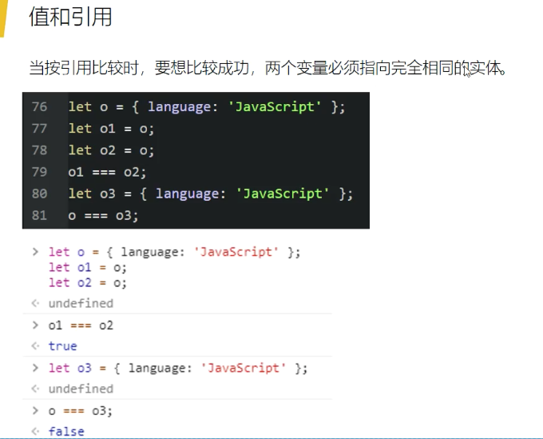
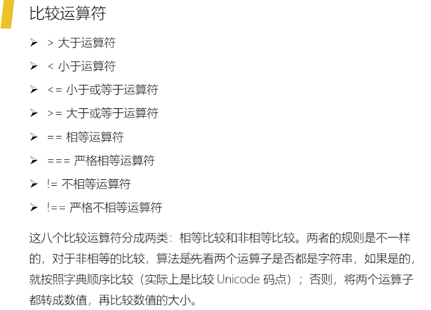
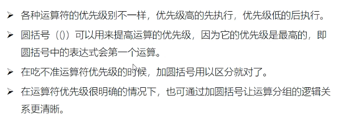
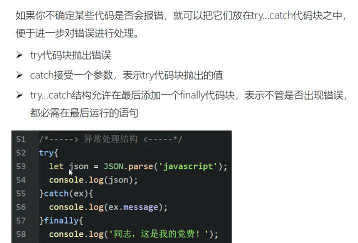
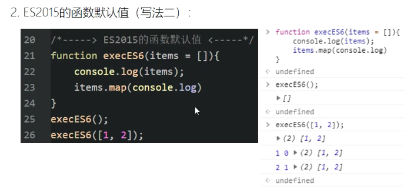
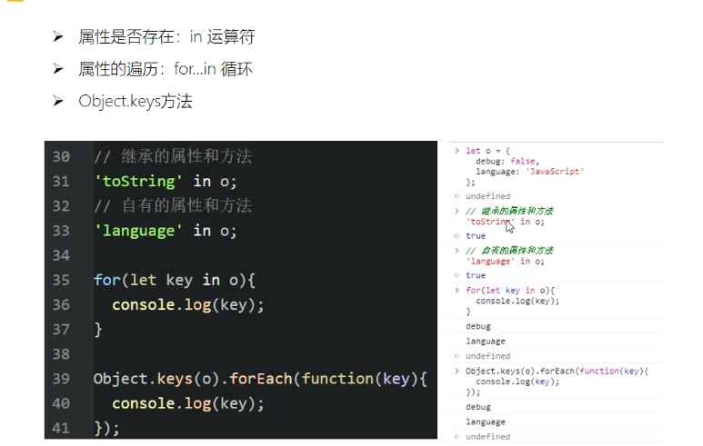
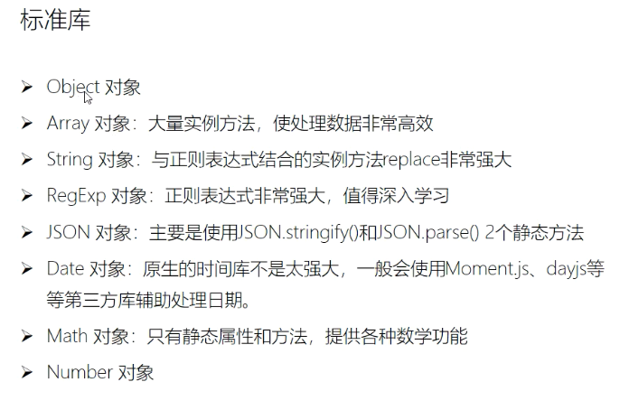

# 参考资料    

- 阮一峰
- MDN js 文档最权威
- node.js 官方文档

# 一、js 数据类型：7种    

## 1.1 种类
- Undefined
    占据了内存的存储空间，已经被定义了，但是没有赋值；undefined 是既没有人坐，也没有人占座的空椅子；既没有座，也没有占座，连椅子也没有，就是变量没有声明（报错，not defined）
- Null
    占据了一个空的存储空间，没有被定义，不知道未来将来要被赋成什么样的值。有座，而且被占座了
- 字符串 String
- 布尔值 bool
    在 js 中有很多东西适当做布尔值。如：0，null
- 数值 Number    
    在 js 内部，所有数字都是以 64 位浮点数形式存储，即使是整数也是如此的。所以，1 与 1.0 是相同的，是同一个数。由此衍生的很多问题，是需要在后续的工作和学习中进一步学习的，有一些坑
- 对象 Object
- 符号类型 Symbol：es6 新引入，在基础中不展开     

## 1.2 值和引用      
变量的复制，传递。比较

- 布尔值和数值的变量是按值来复制、传递和比较的
- 对象、数组和函数是按照引用来复制、传递和比较的
- 字符串是按照引用复制和传递的，按值来比较的     

按值传递和引用的，更改副本和原值不会相互影响     
按引用赋值和传递的，是创建一个指向原事项的指针，更改原始项，则会更改原始值和副本，反之也一样，如果更改副本，也会更改原始项。实际上只有一个实体，"副本"并不是真正的副本，而只是原始值的又一个引用

   ```
   let o = {a: 'javascript'};
   let o1 = o;  // o1 是 {a: 'javascript'};
   let o2 = o;  // o2 是 {a: 'javascript'};   
   
   // 如果直接将 
   o2 = {b: "23"};     
   // 此时，不会改变 o 和 o1, o = o1 还是 {a: 'javascript'};    
   
   // 如果修改 
   o.a = "es";  // o1 会变，o2 因为在上面改了， o2 = {b: "23"}; 这里体现了引用
   ```    
- 引用类型比较的是地址，地址相同，就认为相同。 o3 和 o 对外表现的内容相同，但是两者的地址不一样，所以是结果是 false 

        
 
- 函数传参是按值传递的   

        
    
## 1.3 符号类型和数据类型的转换：也要好好学习！！！！！       

# 二、 运算符    

- 要注意加法运算符，在运行的时候才会决定要怎么做   
  为了避免出现下面图片中奇奇怪怪的结果，对于初学者来说，如果想要数值相加，就转换成数字；如果想要字符串相连，就全部转换成字符串   
  
        
    
- 但是数值运算符，在接收到后端传来的数据，并进行计算的时候，比较有用        

         
    
- 比较运算符      

       
    
- 布尔运算符       
取反运算符及两次取反，可以有效的把布尔类型的变量转换为严格意义的布尔类型，可以使代码变得更严谨。  
&& 和 || 的短路效应，当运算符左侧的表达式已经得到整体结论后，右侧的表达式则不会再执行    

         
    
- 用 圆括号 来改变逻辑运算的顺序     

        
    
# 三、控制流程     

## 3.1 选择结构    
- 单路或二路选择：if
- 三元表达式：
- 多路选择：switch      

           
    
## 3.2 循环结构    

- 在循环的开头测试表达式（while）
- 由计数器控制的循环（for）
- 对对象的每个属性进行操作（for/in）    
- 要注意尽量使用数组自带的方法

## 3.3 异常处理    
处理 json 结构的时候比较常用，这样可以提高代码的健壮性


# 四、js 中的一等公民       

- 默认参数，尽量选择 es5 的方式        

    es5 的写法：    
    

    es6 的写法：     
          
       
    我们前端尽量选择 es5 的写法，原因是万一后端手抖，给了个 null 类型传给前端，那前端也要尽量把 null 接收成空数组。     
    
      
    
# 五、对象       
对象的键值都是字符串，或者是 symbol 值，如果键值是数值，也会被自动转换成字符串

- 判断属性是否在对象里面，用 in    
- 属性的遍历 for in        
- Object.keys 方法，有用，把所有的键值返回成数组，.value 就是把所有的值返回成数组
     
 
## 5.1 构造函数：constructor    

## 六、好好学习以下方面
### 6.1 研究标准库自带的方法
只有这一块好好学习了，处理数据高效，写代码的质量高，也能提高工作效率      

       

### 6.2 浏览器宿主    

       

node      

## 面授预习：     
- 变量的作用域
- 闭包和高阶函数
- 异步编程
- 上下文 this
- 面向对象编程和函数式编程
- 模块化和工程化

# 七、面授1      
## 7.1 前端怎么学

- 在小团队，先求圆解（做好任务），再求深解   
- 在大团队，先用深解，再求圆解，如果是再大团队，螺丝钉工作，由当前工作成为切入点，深入研究
- 法门不二，殊途同归

- 通过读书来学习，对知识点得到系统的认识，比如单元测试，看到书里面的知识点，一定要用在实际项目中，要用
- 工作年限不足道
- 实践是检验的唯一标准


### 7.1.3 源代码学习    
- 立足本职工作，学习开源世界的源代码
    - 新手入门教程和 demo
    - API 文档
    - 细读源码实现     
        - 关注 .git 文件    
        - 触目所及，无一不是好标本。开源代码都是好的，整个项目每一处都需要自己学习
        - 东施效颦，重新实现开源库是大忌，因为浪费时间，得到的结果不一定有用
        - 学习思想重于学习实现

## 7.2 作用域和解构赋值
### 7.2.1 作用域
作用域是变量存在的范围，是层层嵌套的单向膜。声明的时候，作用域就产生了，和运行的时候没有关系；     

const 定义的变量，如果是按值引用的话，就相当于常量；但是如果是引用类型的话，arr，obj，function，就是可以改变的，因为不变的是指针，是内存地址，但是内存地址里面的内容是可以变的

### 7.2.2 解构赋值

## 7.3 闭包和高阶函数
闭包是捕获作用域内的外部绑定


## 7.4 异步编程   


# 八、开发中的科学方法        

## 8.1 开发过程中观察 bug
- 写代码功能拆解，可以帮助我们一部分一部分的查看问题。如果一个 bug 我们可以稳定复现，那么也就知道了 bug 出现的原因，那么就能解决 bug。
- 要多使用 try catch，那么就可以在上线的时候监控哪里出了问题
- chrome 的网络监控，可以尽快的确定是前端的 bug 还是后端的 bug
- 报错的时候，前后端的提示框不一样，这样用户报错截图的时候，就可以快速知道是前端还是后端出了问题

## 8.2 系统优化中的测量
一定要找到自己出问题的证据，数据证据或者其他证据，然后可以去观察，最后就能解决了。
- 识别项目中效率性能瓶颈问题
- 提炼用于分析问题的可以观察测量的指标
- 找到收集、分析指标数据的系列工具
- 在指标的佐证下，识别可以优化的技术环节
- 寻找优化性能的手段
- 持续手机、分析数据、测量评估优化的效果

# 九 this   

## 9.1 this 是什么      
- this是函数被调用时发生的绑定？（我记得是在函数定义的时候就固定了），指向上下文
- 当前的上下文环境对象是什么，完全取决于函数在那里被调用
- 总是指向一个对象

- 函数是一等公民，与其他数据类型享有同等的国民待遇
- 函数是游离的独立值，可以在不同的环境（即上下文）中运行
- this 就是在函数内部，指代函数当前运行环境的对象

## 9.2 使用 this 的注意事项
- 避免多层 this
- 避免数组处理方法中的 this
- 避免回调函数中的 this

## 9.3 固定 this 的方法
- call
- apply
- bind
- 中间变量固定 this

# 十、编程范式   

## 

# 十一、接口契约    
