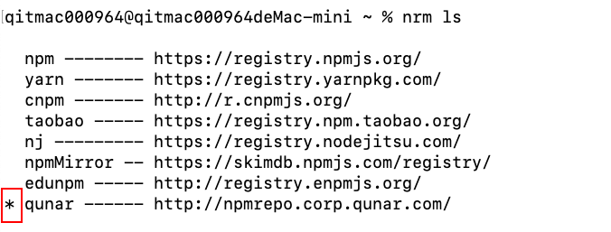

- 查看自己有哪些源： `nrm ls`
    
- 切换到公司的源：`nrm use qunar`
- 查看自己是否已经切换到公司的源：`nrm ls`    
    
- 使用公司的源安装指定的 node 版本:`nvm install 10.15.3`   
       
- 切换成自己指定的 node 版本：`nvm use 10.15.3`
- 查看自己是否切换到自己指定的源：`nvm ls`    

# 一、node 介绍
## 1.1 node.js 的使用场景

- 工具      

- web 服务


## 1.2 node.js 的使用现状

IBM、Inter、天猫、qunar

## 1.3 node.js 环境及开发工具

## 1.4 node.js 调试

- console
- node-inspector

# 二、QXF

- 工程化工具: 初始化项目；初始化服务器；本地开发调试
- q-系列组件
- node 工程的运维 

## 2.1 工程化工具

- 安装 qxf
    - `npm install qxf -g` 安装失败
- 在终端 cd 到项目目录里面执行 `qxf init`
- 根据提示输入内容
- 本地服务启动：
进入到工程根目录，执行 qxf dev 即可启动服务器
    
    - e <env> 自定义环境变量，默认 development
    - debug 单进程启动，可以使用相应端口调试
- 打开浏览器地址栏输入：`127.0.0.1：3000` 就看到页面显示 'hello qxf'
- 为了让文本工程文件有变化的时候，qxf 会自动启动服务，可以通过配置 package.json 里的 watch 字段来排除监听的目录，文件或者后缀   

        
    
### 2.1.2 部署方式
当我们按照前面的方式配置好 qfx 工程，也开发完了，就需要部署到服务器上。服务器申请下来以后是裸机，上面什么也没有，node，qxf 都没有，需要我们自己安装，做环境的配置，进行初始化服务器   

   

- 申请服务器的时候，有个预装软件，选择 qxf  
       
    


## 2.2 q-系列组件
qxf 提供的组建    

- q-multiprocess：多进程组件

       
    
    js 单线程，没有办法多线程，只能做成多进程，主进程监听下面的子进程的状态，如果子进程挂了，主进程就自动重启他。使用的时候在项目目录的 bin/start

- q-template：模板    
使用 node 的主要目的是作为后端接口和前端的中间层，也就是渲染的这一层，这一层必须要有一个模版系统，不然全部手拼很累， 
 
       
    
    
    
   

- q-version：版本号管理   
位置在 app.js

     

- q-monitor：监控

     
     
     配置在 config.js 里面的 monitor 

- q-logger：日志

    

## 2.3 node 工程的运维

### 2.3.1 监控巡查


### 2.3.2 报警设置


### 2.3.3 内存溢出


### 2.3.4 负载升高


```
// axios.all([
            //     axios.get('http://ws.qunar.com/lpisearchd?from=&to=Hot&month=All&cacbefrom=&cacheto=&type=ow&source-fhome'),
            //     axios.get('http://ws.qunar.com/lowerPrice.jcp')
            // ])
            //     .then(axios.spread((interRes, inRes) => {
            //         console.log("data--->", interRes.data);
            //         console.log("data--->", inRes.data);
            //         res.render('index', {});
            //     }))
            //     .catch(err => {
            //         console.log(err);
            //     })
```


