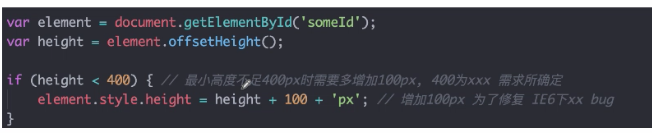
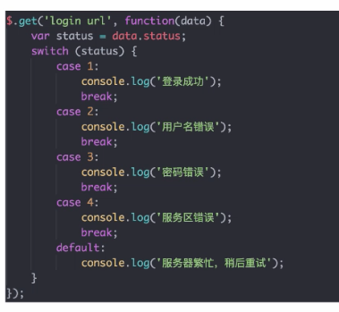

# qunar 代码规范      

## 一、代码规范的目的：    

- 方便阅读
- 减少问题出现的概率
- 降低阅读代码的排斥感   

## 二、JS 编码规范    

- 代码格式
- 编码禁忌
- 推荐使用   

### 2.1 常见的代码格式要求     

- 缩紧 - 4 个空格   
- 行宽 - 100 个字符
- 变量声明 
    - 使用之前声明
    - "_" 开头代表变量为私有
    - 大多数变量和方法名应该以小写字母开始
    - 全局变量应该全部使用大写字母
    - 类名使用大写字母开头
    - jQuery 对象使用 $ 开头
- 注释
- 空格隔开
    - 操作符
    - 关键字
    - 逗号后面
    - 冒号后面
    - 注释之前需要有空格
    
- 代码块格式

### 2.2 编码禁忌
- 不要格式化他人的代码，否则：
     - QA 人员测试的时候，会对比本次代码和上次代码的区别，即使是改了空格，他们在测试的时候会发现有大量的代码进行了修改，就会对代码进行逐行审核，增加了他们的工作量。
    - 提交的代码仓库，别人在 pull 的时候，会有很多冲突，增加了解决的时间
    
- 不能使用 with
- 不能使用 `new Object()` 声明对象，应该使用花括号 {} 的方式进行声明
- 不能使用 `new Array()` 声明数组，应该直接使用 []
- debugger 调试用的标签不能有
- `if (condition) doSomething();` 正确的方式应该用 {}，不利于后面的人进行修改，增加语句
- if 嵌套不能超过三层，应该对 if 里面的逻辑进行封装，让代码的可读性更强
- 不要回调嵌套，比如在写 ajax 请求数据的时候，就会出现回调地狱，呈现三角形的走势，那么此时，应该采取：
    - promise 的同步写法的方式
    - Generators/yield （ES6）
    - Async/await(ES7) 
- 不要使用魔法数字  

        
   
    上图中的 400，和 100 就是魔法数字，为什么是 400，而不是 500，600，这个 400 是什么意思，反正 400 就是能跑通，真是一个魔法数字！       
    
    为了避免这种情况我们应该怎样做：  
    - 在写代码的时候，要对这段代码进行详细的说明，400 和 100 的含义，应用的场景  
          
    
    - 把 400 和 100 定义成一个语义明确的常量，这样别人在看代码的时候，能够明白这两个数字的意义        
           
    
- 使用 `===` 和 `!==`，不能使用 `==` 和 `!=`   
   
### 2.3 推荐使用

- 单个文件不超过 1000 行
- 单个函数不超过 100 行
- 单个函数的复杂度不超过 10
- 单个函数的参数不超过 7，可以把这些参数封装成对象，一对象的方式传入参数
- 字符串使用单引号，html 的属性使用的双引号，如果字符串再使用双引号的话，会报错，所以外层用单引号扩起来     

## 三、css 编码规范     

- 使用 link 标签引入 css 文件
- 禁止在 html 中直接书写 `<style>` 代码块
- 禁止使用 style 属性书写样式
- 禁止使用 expression 表达式，为了性能和兼容性
- 不建议使用 * 通配符，为了性能
- 不建议使用 id # 选择器，推荐使用 class

## 四、Sonar 检查    
Snor 是 qunar 的代码检查，流程是：

- 代码提交到代码仓库    
- Snor 检查，只有 Snor 通过，代码才能上线；如果不通过，会被打回，需要重新修改，然后再提交。Snor 检查主要有四种结果    
    
    - 阻断：禁止上线
    - 严重：禁止上线
    - 主要：
    - 次要：   
    
  有一些特殊情况，比如引入了第三方的文件，里面可能有一些书写不规范的地方，但是又不能修改第三方的类库，此时可以申请排除：发送邮件到 cm-request@qunar.com，fe-tc@qunar.com。邮件组申请排除，注明排除文件列表路径，排除原因       
        
  可以使用公司里面的 lib，http://ued.qunar.com/lib/ 里面有 axios、jquery、zepto、react、veu、backbone.js、lodash.js、underscore.js、fastclick    
  
## 五、最佳实践    

- 写人可读的代码：
- 变量在使用前定义
- 逻辑的封装： 颗粒度细，最大程度复用；封装的函数功能要尽可能单一；业务逻辑也可以封装
- 短小精悍的函数
- 尽可能的使用缓存:     
        
    
    - 第一段代码，循环获取 dom 10000 次；优化：把 id 元素提取成全局变量    
    - 第二段代码，每次点击的时候都去请求后端接口获取数据，实际上每次获取的数据都是一样的，可以请求一次数据，然后把数据缓存在一个变量中
    
        
    
- 谨慎使用全局变量
- 不能缺少的注释
- 对象属性查找来代替数组查找      

          
    
    数组需要遍历才能确定值存不存在，效率低；对象属性的查找只是一个 HashMap 的 key 查找过程，效率高

- 合理使用 map 代替 switch case    

       
    
    
    
    

- 自执行函数的前后分号    

    

- try catch 的使用    

    对调用的接口不完全了解内部运行的时候，不知道某个接口函数的内部执行机制，不确定他会不会报错，就可以用 try catch 

- 不要信任你的队友    
  不要相信队友的代码，要进行前期的校验     
   

