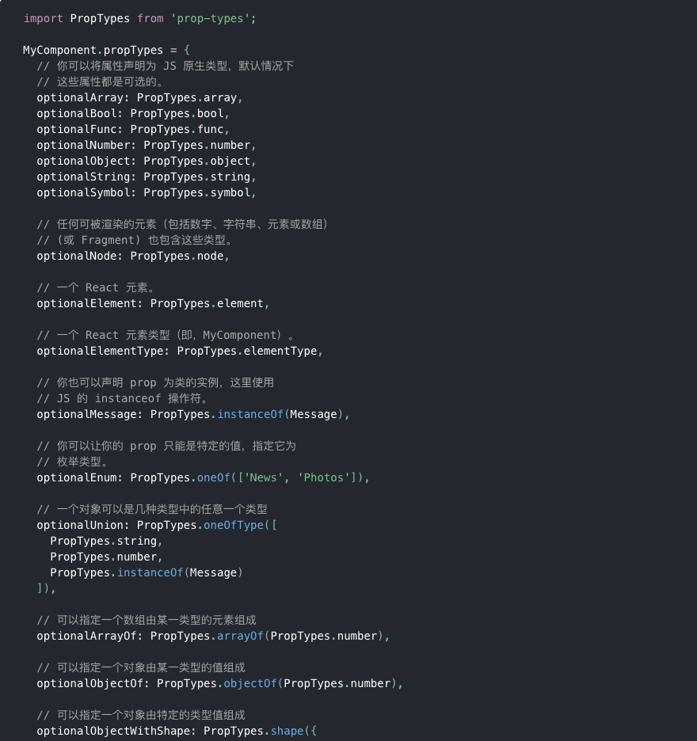
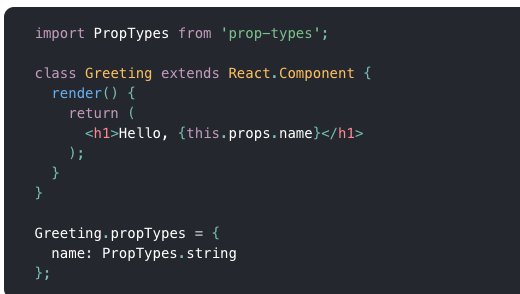
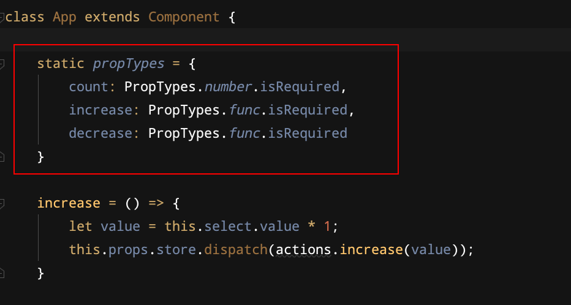

# v1.0 --- src-01react    
使用纯粹的 react 写的计数器功能。缺点是，state 是在 app 组件中维护的，简单的应用还好，复杂的应用 state 借助父组件传来传去，数据流不清晰，不易于管理数据   

# v2.0 --- src-02redux
在项目目录下执行：`npm install --save redux`      
使用 redux 进行状态管理，state 统一在 store 对象中管理起来，但是缺点是，在 react 组件中，react 和 redux 的 store.dispatch  函数耦合在一起，代码不够简洁。

# v3.0 --- src-03react-redux
优化 v2.0 版本    
在项目目录下执行： `npm install --save react-redux`     
借助 react-redux 使得 react 变成不依赖 redux 的纯粹的 react 代码

### 3.1 react-redux 将左右的组建分成两大类：UI 组件和容器组件         

### UI组件     
- 只负责 UI 的呈现，不带有任何的业务逻辑
- 通过 props 接收数据（一般数据和函数）
- 不用任何 redux 的 API
- 一般保存在 components 文件夹下

### 容器组件     
- 负责管理数据和业务逻辑，不负责 UI 的呈现
- 使用 redux 的 API
- 一般保存在 containers 文件夹下

## PropType 验证传入变量类型

在项目目录下执行：    

`npm install --save prop-types`    

     

在组件外部使用方法   

在组件内部的使用方法：    

